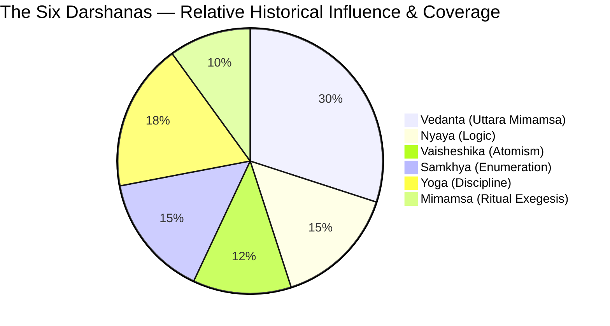

# Indian Philosophy — Overview

> [!NOTE]
> Indian philosophy is a 3,500-year investigation into one question: **What is real — and how does knowing it set you free?**

---

## Key Facts at a Glance

| Dimension | Detail |
|-----------|--------|
| **Time Span** | ~1500 BCE (Rig Veda) to the present — over 3,500 years of continuous inquiry |
| **Key Philosophers** | Kanada (atomist), Adi Shankaracharya (Advaita), Ramanuja (Vishishtadvaita), Madhvacharya (Dvaita), Gautama Buddha (Buddhist critique), Badarayana (Brahma Sutras) |
| **Six Orthodox Schools** | Nyaya, Vaisheshika, Samkhya, Yoga, Mimamsa, Vedanta |
| **Key Concepts** | Brahman (ultimate reality), Atman (self/soul), Maya (illusion/misperception), Moksha (liberation), Karma (action + consequence), Samsara (cycle of rebirth) |
| **Key Texts** | Four Vedas, 108 Upanishads, Brahma Sutras, Bhagavad Gita, Vaisheshika Sutras, Yoga Sutras |

---

## At a Glance — The Six Orthodox Schools

> [!TIP]
> Think of the six schools (called **Darshanas** — literally "viewpoints") as six different engineering teams trying to solve the same problem — the nature of reality — using different methodologies. Vedanta became the dominant "tech stack," but the others contributed crucial sub-systems.

---

## Summary

### Why Indian Philosophy Matters

Imagine you're a software engineer and someone asks: "What is the operating system that runs all of existence?" That's the opening question of Indian philosophy. For over three and a half millennia, thinkers on the Indian subcontinent have been wrestling with the deepest questions a human mind can ask: Is consciousness fundamental or emergent? Is the world real or a simulation? Is the "you" reading this sentence the same "you" that woke up this morning? These aren't abstract games — the Indian tradition insists the answers change how you live, and ultimately whether you escape suffering altogether.

### The Central Question

At the heart of everything is a deceptively simple question: **What is Brahman?** (Brahman = the ultimate ground of all being, the source code of reality itself.) And its twin: **What is Atman?** (Atman = the individual self, the "I" behind your thoughts.) Depending on how you answer the relationship between Brahman and Atman, you get an entirely different philosophy of life, ethics, and liberation. Are they identical? Distinct? Related but not equal? These three answers gave rise to Advaita, Dvaita, and Vishishtadvaita respectively — three grand competing systems, all from South India, all debating each other across centuries.

### The Landscape

The tradition broadly divides into **Astika** (orthodox, accepting Vedic authority) and **Nastika** (heterodox, rejecting it — including Buddhism and Jainism). Among the orthodox schools, the **six Darshanas** cover everything from formal logic (Nyaya), atomic theory (Vaisheshika), and proto-evolutionary cosmology (Samkhya), to mind-body practice (Yoga), ritual philosophy (Mimamsa), and the grand metaphysics of Vedanta. Vedanta itself later split into three major sub-schools. Meanwhile, the **Upanishads** — the philosophical dialogues at the end of the Vedas — contain the mystical seeds from which all of Vedanta grew. Famous teacher-disciple conversations like Nachiketa and the God of Death (Yama), or the enigmatic statement *Tat Tvam Asi* ("That Thou Art"), are the founding stories of the tradition.

### Why It's Still Relevant

For Sandeep in Bangalore in 2026, this tradition isn't ancient history. The concepts of Karma (every action has consequences — like a function with side effects), Dharma (your duty/right path — like a code contract you're meant to honour), and Moksha (liberation — like finally exiting the infinite loop of suffering) are woven into South Indian culture, language, and family life. Shankaracharya was born in Kerala — your neighbouring state. Ramanuja systematised his theology in Tamil Nadu. Madhva hailed from Udupi, Karnataka. This is your regional intellectual heritage. And the questions they asked — about consciousness, identity, and freedom — are precisely the questions that modern neuroscience, quantum mechanics, and AI researchers are circling back to from the other direction.

---

*Next: See `01_deep_dive.md` for the full treatment of every sub-topic.*
