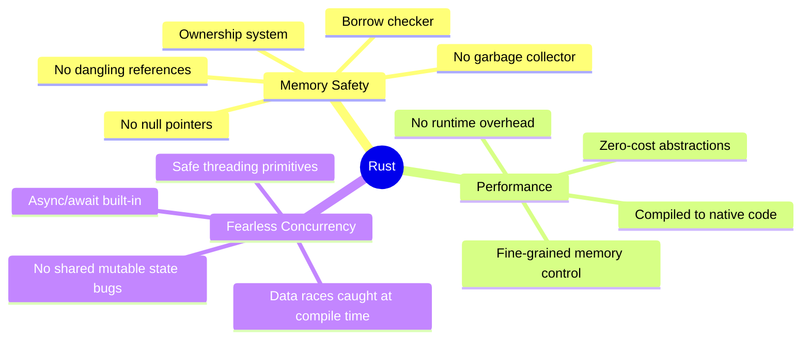
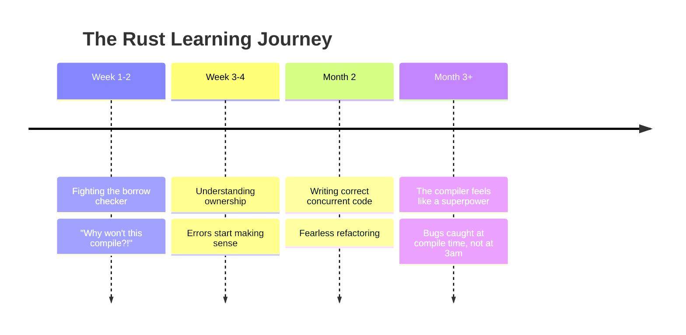

# What Is Rust and Why Learn It?

You've probably written Python scripts, built Java services, or dabbled in C++. Each of those languages made a trade-off: Python traded speed for simplicity, Java traded manual memory management for a garbage collector, and C++ gave you raw power at the cost of a minefield of memory bugs. Rust asks a different question: *what if we didn't have to make that trade-off at all?*

This file gives you the big picture — what Rust is, why the industry is betting on it, and whether it's the right tool for you.

---

## The Core Problem Rust Solves

Most software bugs that lead to real-world security vulnerabilities are **memory safety bugs**. Things like:

- Reading memory you've already freed (*use-after-free*)
- Writing past the end of a buffer (*buffer overflow*)
- Two threads modifying the same data at the same time (*data race*)

> [!NOTE]
> Microsoft analysed their security patches and found that **~70% of all CVEs (Common Vulnerabilities and Exposures)** over the previous decade were caused by memory safety issues. Google reported a similar figure (~70%) for Chrome bugs. These are not edge cases — they are the *default outcome* of writing C or C++.

Languages like Python and Java solve this by using a **garbage collector** — a background process that automatically frees memory you no longer need. This works, but it has a cost: unpredictable pauses (the GC runs whenever it feels like it) and significant memory overhead.

Rust takes a third path. It enforces memory safety **at compile time**, through its ownership system. There is no garbage collector. There are no runtime pauses. You get the speed of C++ with the safety guarantees of a managed language — and the compiler catches your mistakes before your program ever runs.

---

## Rust's Three Pillars

These three pillars are not independent features — they are consequences of the *same* design decision: the **ownership and borrowing system**. Once you understand ownership (files 03 and 04), the other two pillars follow naturally.

---

## How Does Rust Compare?

| Feature | Python | Java | C++ | Rust |
|---|---|---|---|---|
| **Memory management** | Garbage collected | Garbage collected | Manual (new/delete) | Ownership (compile-time) |
| **Runtime speed** | Slow (interpreted) | Medium (JVM JIT) | Very fast | Very fast |
| **Memory safety** | Safe (GC) | Safe (GC) | Unsafe | Safe (no GC!) |
| **Null pointers** | `None` can crash | `NullPointerException` | Dangling pointers | No null — uses `Option<T>` |
| **Concurrency safety** | GIL limits true threads | Careful sync needed | Easy to make data races | Data races are compile errors |
| **Compile time** | N/A (interpreted) | Medium | Medium | Slow (but catching your bugs) |
| **Learning curve** | Gentle | Moderate | Steep | Steep (upfront), then smooth |
| **Package manager** | pip | Maven/Gradle | None standard | Cargo (excellent) |

> [!TIP]
> If you're coming from Python, the biggest mental shift is that Rust is **compiled** and **statically typed** — the compiler checks everything before your code runs. If you're coming from Java, the biggest shift is that there is **no garbage collector** and you are in direct control of memory layout.

---

## Who Is Using Rust?

Rust has moved well beyond "interesting experiment" into production-critical systems:

| Organisation | What they use Rust for |
|---|---|
| **Linux Kernel** | Second language for kernel drivers (since 6.1, 2022) |
| **Android (Google)** | New OS components; memory safety goal for AOSP |
| **Windows (Microsoft)** | Rewriting parts of the Windows kernel |
| **Mozilla** | Born here — Firefox's Servo rendering engine |
| **AWS** | Firecracker (microVM engine powering Lambda and Fargate) |
| **Cloudflare** | Proxies, edge workers, internal tooling |
| **Discord** | Replaced Go services; 10x latency improvement reported |
| **Dropbox** | Core file sync engine |
| **Meta** | Backend services, Diem blockchain |
| **npm** | Registry service rewrite |

> [!NOTE]
> Rust has been the **most admired programming language** in the Stack Overflow Developer Survey for **nine consecutive years** (2016–2024). That's not just hype — developers who use Rust overwhelmingly want to keep using it.

---

## The "Friction Upfront, Payoff Long-Term" Framing

Here's the honest truth: **Rust has a steep initial learning curve.** The compiler will reject code that would work fine (or *seem* to work fine) in other languages. You'll see error messages like `error[E0382]: borrow of moved value` or `error[E0505]: cannot move out of value because it is borrowed`, and they will feel frustrating at first.

But here's the insight that experienced Rust developers share: *the compiler is not your enemy — it's a very opinionated pair programmer who catches bugs before they reach production.*

In Python or Java, you *can* write buggy code that compiles and runs — the bugs surface at runtime, in production, at 3am. In Rust, a large class of bugs simply cannot compile. You pay the price upfront, in your development environment, where fixing bugs is cheap.

---

## Who Is Rust For?

Rust is a great fit if you:

- Build **systems software**: OS components, databases, networking stacks, game engines
- Need **high performance** without garbage collector pauses
- Write **embedded software** for microcontrollers (no runtime, no OS needed)
- Build **WebAssembly** (WASM) — Rust is the leading language for WASM
- Want to write **safe concurrent code** without learning all of Java's synchronisation primitives
- Are tired of memory bugs in C/C++ code you maintain

Rust is *probably not* the right first choice if you:

- Are building a quick data science script (use Python)
- Are building a standard web CRUD app with a team that knows Java/Go (use what your team knows)
- Need to ship a prototype in a day (Rust's compile-time strictness slows early exploration)

> [!TIP]
> For a software engineer in Bangalore with Python/Java background, Rust is most valuable as a **second systems language** — something to reach for when you need maximum performance, are working on infrastructure, or want to truly understand how memory works. Many engineers find that learning Rust makes them significantly better at their primary language too, because it forces a deep understanding of memory, ownership, and concurrency.

---

## A Brief History

Rust was started in **2006** as a personal project by Graydon Hoare, a Mozilla employee. Mozilla sponsored development from 2009, and the **1.0 release** came in **May 2015**. Since then, Rust has shipped a new stable release every **six weeks**, with a strong backwards compatibility guarantee.

In 2021, the **Rust Foundation** was formed — an independent non-profit backed by Mozilla, Google, Microsoft, Amazon, and Meta — to steward the language and ensure it isn't controlled by any single company.

---

## What's Next

In the next file, **01_getting-started.md**, you'll install Rust, meet `cargo` (Rust's build tool and package manager), and write your first two programs: the classic Hello World and a temperature converter. By the end of that file, you'll have a working Rust environment and an intuition for how Rust code is structured.
