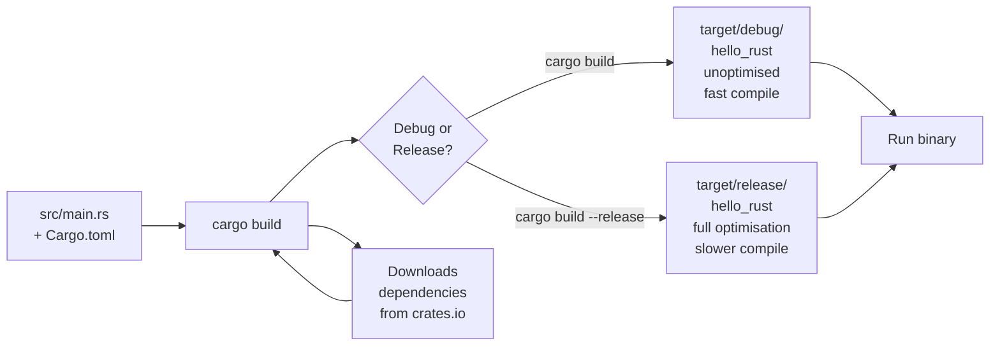

# Setup and Your First Programs

The fastest way to understand a programming language is to run code. This file gets you from zero to a working Rust environment in about 10 minutes, then walks you through two real programs so you can start developing intuition for how Rust thinks.

---

## Installing Rust with rustup

Rust uses **rustup** — a command-line tool that manages Rust versions and associated tools (think `nvm` for Node, or `pyenv` for Python). The official way to install Rust is through rustup, not through your OS package manager.

### Linux / macOS

Open a terminal and run:

```bash
curl --proto '=https' --tlsv1.2 -sSf https://sh.rustup.rs | sh
```

Follow the prompts (the defaults are fine). After installation, either restart your terminal or run:

```bash
source "$HOME/.cargo/env"
```

### Windows

Download and run **rustup-init.exe** from [rustup.rs](https://rustup.rs). You'll also need the **MSVC Build Tools** (the installer will prompt you). If you're on Windows with WSL2 (Windows Subsystem for Linux), you can follow the Linux instructions above inside your WSL terminal — this is often the smoother path.

### Verify the installation

```bash
rustc --version   # e.g. rustc 1.77.0 (aedd173a2 2024-03-17)
cargo --version   # e.g. cargo 1.77.0 (1f92a25cc 2024-03-17)
```

> [!NOTE]
> **rustc** is the Rust compiler. **cargo** is the build system and package manager. In practice, you'll almost never call `rustc` directly — you'll use `cargo` for everything.

### Keeping Rust up to date

```bash
rustup update     # updates to the latest stable Rust
```

---

## Meet Cargo: npm + pip + Maven in One

If you've used Python, you know `pip` for installing packages. If you've used Node.js, you know `npm` for packages *and* running scripts. If you've used Java, you know Maven or Gradle for building multi-module projects. Rust's **Cargo** does all of these things, and it does them well:

| What you want to do | pip (Python) | npm (Node) | Maven (Java) | Cargo (Rust) |
|---|---|---|---|---|
| Create a new project | — | `npm init` | `mvn archetype:generate` | `cargo new` |
| Build your code | — | `npm run build` | `mvn compile` | `cargo build` |
| Run your code | `python main.py` | `npm start` | `mvn exec:java` | `cargo run` |
| Run tests | `pytest` | `npm test` | `mvn test` | `cargo test` |
| Add a dependency | `pip install X` | `npm install X` | edit pom.xml | `cargo add X` |
| Check for errors (no binary) | — | — | — | `cargo check` |
| Build optimised release | — | — | — | `cargo build --release` |

> [!TIP]
> Use `cargo check` constantly while writing code. It type-checks your code and reports errors **without** producing a binary, so it's much faster than `cargo build`. Many Rust developers have their editor run `cargo check` on every save.

---

## Creating Your First Project

```bash
cargo new hello_rust
cd hello_rust
```

This creates a directory with this structure:

```
hello_rust/
├── Cargo.toml      ← project manifest (like package.json or pom.xml)
└── src/
    └── main.rs     ← your source code
```

**Cargo.toml** looks like this:

```toml
[package]
name = "hello_rust"
version = "0.1.0"
edition = "2021"

[dependencies]
# nothing yet
```

The `edition` field refers to the Rust **Edition** — a backwards-compatible way to introduce language improvements. Use `edition = "2021"` for all new projects.

---

## Hello, World — and What Every Line Means

Open `src/main.rs`. Cargo has already written Hello World for you:

```rust
fn main() {
    println!("Hello, world!");
}
```

Run it:

```bash
cargo run
```

You'll see:

```
   Compiling hello_rust v0.1.0 (/path/to/hello_rust)
    Finished dev [unoptimized + debuginfo] target(s) in 0.42s
     Running `target/debug/hello_rust`
Hello, world!
```

Now let's look at every part of the code:

### `fn main()`

`fn` is the keyword to declare a function (like `def` in Python or `void`/return-type in Java). `main` is the special entry point — every Rust binary must have a `main` function. The `()` means it takes no parameters.

### `println!("Hello, world!")`

`println!` is a **macro**, not a function. In Rust, macros end with `!`. You can think of macros as code that writes code — they're expanded at compile time. `println!` handles formatting strings in a way that a regular function can't (it inspects the types of its arguments at compile time). For now, just treat it like `print()` in Python.

### Semicolons `;`

In Rust, most **statements** end with a semicolon. You'll learn in file 02 that the *absence* of a semicolon on the last line of a block means "return this value." This distinction matters — it's one of Rust's most elegant (and initially confusing) features.

### Curly braces `{}`

Like Java and C++, Rust uses `{}` to delimit blocks. Unlike Python, indentation has no semantic meaning — it's purely stylistic (but `rustfmt` enforces a consistent style automatically).

---

## The Cargo Build Pipeline



> [!NOTE]
> The **debug build** (`cargo build`) compiles fast and includes debug info. It also enables **overflow checking** for integers. The **release build** (`cargo build --release`) turns on full LLVM optimisations and can be 10–100x faster at runtime — always use release builds for benchmarking or production.

---

## Your Second Program: Temperature Converter

Let's write something more interesting. Replace `src/main.rs` with:

```rust
fn celsius_to_fahrenheit(c: f64) -> f64 {
    c * 9.0 / 5.0 + 32.0
}

fn fahrenheit_to_celsius(f: f64) -> f64 {
    (f - 32.0) * 5.0 / 9.0
}

fn main() {
    let boiling_c = 100.0;
    let boiling_f = celsius_to_fahrenheit(boiling_c);
    println!("{} °C = {} °F", boiling_c, boiling_f);

    let body_temp_f = 98.6;
    let body_temp_c = fahrenheit_to_celsius(body_temp_f);
    println!("{} °F = {:.1} °C", body_temp_f, body_temp_c);
}
```

Run it with `cargo run`:

```
100 °C = 212 °F
98.6 °F = 37.0 °C
```

### What's new here?

- **`f64`** — a 64-bit floating-point number (like `double` in Java). Rust requires you to be explicit about number types.
- **`-> f64`** — the return type of the function. Rust uses `->` to specify what a function returns.
- **`let boiling_c = 100.0`** — declaring a variable with `let`. Notice: no type annotation needed here — Rust *infers* that `100.0` is an `f64`.
- **`{:.1}`** in the format string — format specifiers work like Python's f-strings. `:.1` means "1 decimal place."
- **No `return` keyword** — the last expression in `celsius_to_fahrenheit` (`c * 9.0 / 5.0 + 32.0`) has no semicolon, so it is automatically the return value. This is idiomatic Rust.

> [!TIP]
> Rust can infer most types from context. You don't always need to write `let x: f64 = 1.0` — `let x = 1.0_f64` or even `let x = 1.0` (when context makes the type clear) works fine. However, when writing functions, **always** annotate parameter and return types. This makes your code self-documenting and helps the compiler give better error messages.

---

## Useful Cargo Commands Reference

```bash
cargo new my_project         # Create a new binary project
cargo new --lib my_lib       # Create a new library project
cargo build                  # Compile (debug mode)
cargo build --release        # Compile (optimised)
cargo run                    # Build + run
cargo run -- arg1 arg2       # Build + run with command-line arguments
cargo check                  # Type-check only (fastest feedback)
cargo test                   # Run all tests
cargo doc --open             # Generate and open documentation
cargo add serde              # Add a dependency (like pip install)
cargo update                 # Update dependencies to latest compatible versions
cargo fmt                    # Format your code (like Black for Python)
cargo clippy                 # Lint your code (catches common mistakes)
```

> [!TIP]
> Install the Rust Analyzer extension for VS Code (`rust-lang.rust-analyzer`). It provides inline type hints, autocomplete, and runs `cargo check` on every save. This dramatically improves the development experience, especially when you're learning.

---

## What's Next

In **02_core-concepts.md**, we cover the building blocks of Rust programs: variables and mutability, the type system (integers, floats, booleans, chars), compound types (tuples and arrays), functions, and control flow. These are the everyday vocabulary of Rust — understand them and the later topics (ownership, borrowing) will make much more sense.
