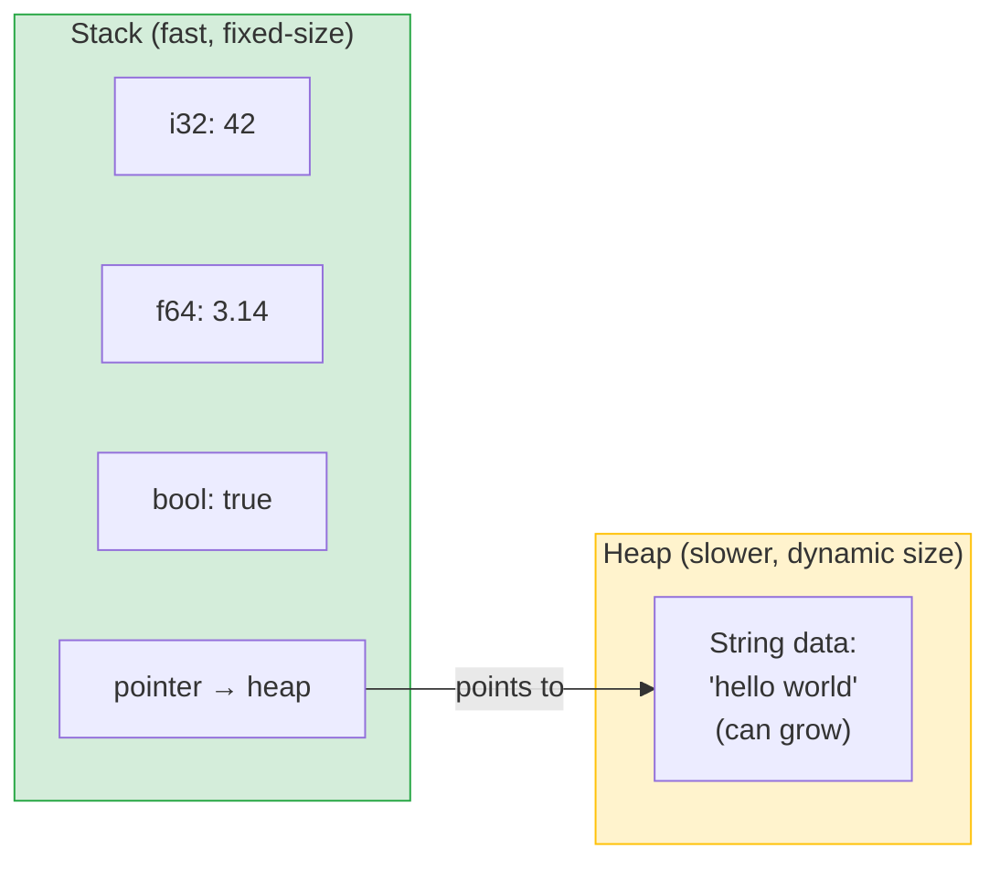
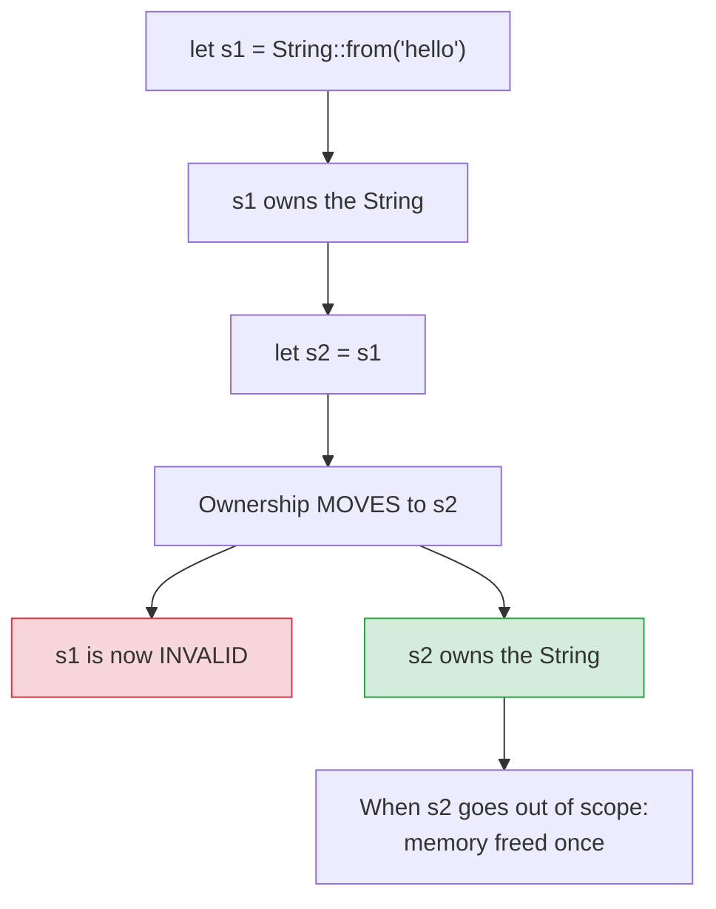

# Ownership: Rust's Superpower

Every programming language has to answer the same question: when you allocate memory for data, how does that memory get freed? Python and Java use a **garbage collector** that periodically finds and frees unreachable memory. C and C++ make the programmer do it manually with `malloc`/`free` or `new`/`delete`. Both approaches have costs.

Rust uses a completely different mechanism: **ownership**. Memory is freed automatically when the owner goes out of scope — no garbage collector, no manual `free()`, no runtime overhead. The rules are enforced entirely at compile time.

This is the single most important concept in Rust. Everything else — borrowing, lifetimes, the borrow checker — is built on top of it.

---

## Stack vs Heap — Why It Matters

Before we can understand ownership, we need to understand *where* data lives in memory.



**Stack:**
- Fixed-size data allocated and freed in a last-in-first-out order
- Very fast — just moving a stack pointer
- Examples: integers, floats, booleans, fixed-size arrays, tuples of scalar types
- Size must be known at compile time

**Heap:**
- Dynamically sized data allocated at runtime
- Slower — requires finding free space, bookkeeping
- Examples: `String`, `Vec<T>`, `Box<T>`
- The program gets back a *pointer* (memory address) to the allocated space

> [!NOTE]
> When you write `let s = String::from("hello")`, the variable `s` on the stack holds a small struct containing: a pointer to heap memory, a length, and a capacity. The actual string bytes live on the heap. This is important for understanding what "moving" a value means.

---

## The Three Rules of Ownership

> [!NOTE]
> **The Three Rules of Ownership** — memorise these. Everything else follows from them.
>
> 1. Each value in Rust has exactly **one owner**.
> 2. There can only be **one owner at a time**.
> 3. When the owner goes **out of scope**, the value is dropped (memory freed).

Let's see what these mean in practice.

### Rule 3: Scope and Drop

```rust
fn main() {
    {
        let s = String::from("hello");  // s is valid from here
        println!("{}", s);
    }   // ← s goes out of scope HERE. Rust calls `drop(s)` automatically.
        //   The heap memory for "hello" is freed at this exact point.

    // println!("{}", s);  // compile error — s no longer exists
}
```

This is **RAII** (Resource Acquisition Is Initialization) — a pattern from C++. The resource (memory) is tied to the lifetime of the variable. When the variable dies, the resource is freed. No GC needed.

---

## Move Semantics: Rule 2 in Action

Here's where things get interesting. What happens when you assign one variable to another?

### With simple types (stack data):

```rust
let x = 5;
let y = x;   // x is COPIED — both x and y are valid
println!("x={}, y={}", x, y);  // works fine
```

Integers are tiny and live entirely on the stack. Copying is trivially cheap, so Rust just copies the value.

### With heap-allocated types:

```rust
let s1 = String::from("hello");
let s2 = s1;   // ownership MOVES from s1 to s2
println!("{}", s1);  // COMPILE ERROR!
```

```
error[E0382]: borrow of moved value: `s1`
 --> src/main.rs:4:20
  |
2 |     let s1 = String::from("hello");
  |         -- move occurs because `s1` has type `String`,
  |            which does not implement the `Copy` trait
3 |     let s2 = s1;
  |              -- value moved here
4 |     println!("{}", s1);
  |                    ^^ value borrowed here after move
```

Why? Because `String` data lives on the heap. If Rust let both `s1` and `s2` be valid at the same time, *both* would try to free the same heap memory when they went out of scope — a **double free** bug, one of the classic memory safety errors. Instead, Rust **moves** the ownership: after `let s2 = s1`, `s1` is invalid, and only `s2` owns the data.

Think of it like a physical book: if you **give** your book to a friend, you no longer have it. You can't give it to someone else too.



---

## Clone: Making a True Copy

If you *do* want two independent copies of heap data, use `.clone()`:

```rust
let s1 = String::from("hello");
let s2 = s1.clone();   // deep copy — both are valid
println!("s1={}, s2={}", s1, s2);  // works!
```

Clone is an explicit, conscious decision. It's like photocopying the book — you have two separate copies, and either can be thrown away independently.

> [!WARNING]
> `.clone()` can be expensive — it allocates new heap memory and copies all the data. Don't use it reflexively to silence ownership errors. Often, **borrowing** (the next file) is the right solution — it lets you *use* a value without taking ownership of it.

---

## The Copy Trait: When Assignment Copies Instead of Moves

Some types implement the **`Copy` trait**, which tells Rust "this type is safe and cheap to copy bitwise on the stack." For these types, assignment copies rather than moves:

| Type | Copy? | Reason |
|---|---|---|
| `i8`, `i16`, `i32`, `i64`, `i128` | Yes | Stored entirely on stack |
| `u8`, `u16`, `u32`, `u64`, `u128` | Yes | Stored entirely on stack |
| `f32`, `f64` | Yes | Stored entirely on stack |
| `bool` | Yes | Single byte on stack |
| `char` | Yes | 4 bytes on stack |
| `(i32, i32)` | Yes | Tuple of Copy types |
| `[i32; 3]` | Yes | Array of Copy types, fixed size |
| `String` | **No** | Points to heap data |
| `Vec<T>` | **No** | Points to heap data |
| `Box<T>` | **No** | Smart pointer to heap |

> [!NOTE]
> A type can be `Copy` only if **all** of its parts are `Copy`. A struct containing a `String` field is not `Copy` because `String` isn't. A struct containing only `i32` fields can be `Copy`.

### The Book Analogy

| Operation | Book analogy | Rust |
|---|---|---|
| **Ownership** | You have the book | One variable owns the value |
| **Move** | You give the book to a friend | `let s2 = s1` — s1 invalid |
| **Clone** | You photocopy the book | `let s2 = s1.clone()` |
| **Copy** | The "book" is a sticky note | Simple types like `i32` — both copies valid |
| **Drop** | Book goes out of scope; you throw it away | Memory freed automatically |

---

## Ownership Through Functions

Move semantics apply to function calls too — passing a value to a function moves (or copies) it:

```rust
fn takes_ownership(s: String) {
    println!("{}", s);
}   // s drops here — memory freed

fn makes_copy(n: i32) {
    println!("{}", n);
}   // n drops here — but it was a copy, so original is fine

fn main() {
    let s = String::from("hello");
    takes_ownership(s);
    // println!("{}", s);  // ERROR: s was moved into the function!

    let n = 42;
    makes_copy(n);
    println!("{}", n);  // fine — i32 is Copy
}
```

And returning a value from a function moves it to the caller:

```rust
fn give_string() -> String {
    let s = String::from("hello");
    s   // move out of function to caller
}

fn main() {
    let s = give_string();   // s now owns the String
    println!("{}", s);
}
```

This ownership-in, ownership-out pattern works, but it's cumbersome if you just want a function to *use* a value temporarily. That's exactly what **borrowing** solves — and it's covered in the next file.

---

## The `drop` Function and RAII

Rust automatically calls `drop` when a value goes out of scope. You can also call it manually to release a resource *early*:

```rust
fn main() {
    let s = String::from("some big data");
    println!("Using s: {}", s);
    drop(s);   // explicitly free s now
    println!("s has been dropped");
    // println!("{}", s);  // compile error — s is invalid after drop
}
```

This is the foundation of **RAII** in Rust. Database connections, file handles, mutex locks — they all implement `drop` to release their resources automatically when the variable goes out of scope. You can't accidentally forget to close a file or release a lock.

> [!TIP]
> You almost never need to call `drop` manually. The point is that Rust *guarantees* drop will be called exactly once, at the right time, even if an error occurs. This is far more reliable than `finally` blocks in Java or `try/finally` in Python.

---

## What's Next

In **04_borrowing-references.md**, we meet the solution to the "move or clone" dilemma. **Borrowing** lets you pass a value to a function *without* transferring ownership — like lending your book rather than giving it away. It's the key to writing ergonomic Rust without constantly cloning data.
