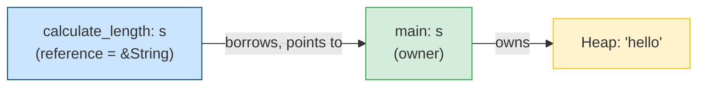
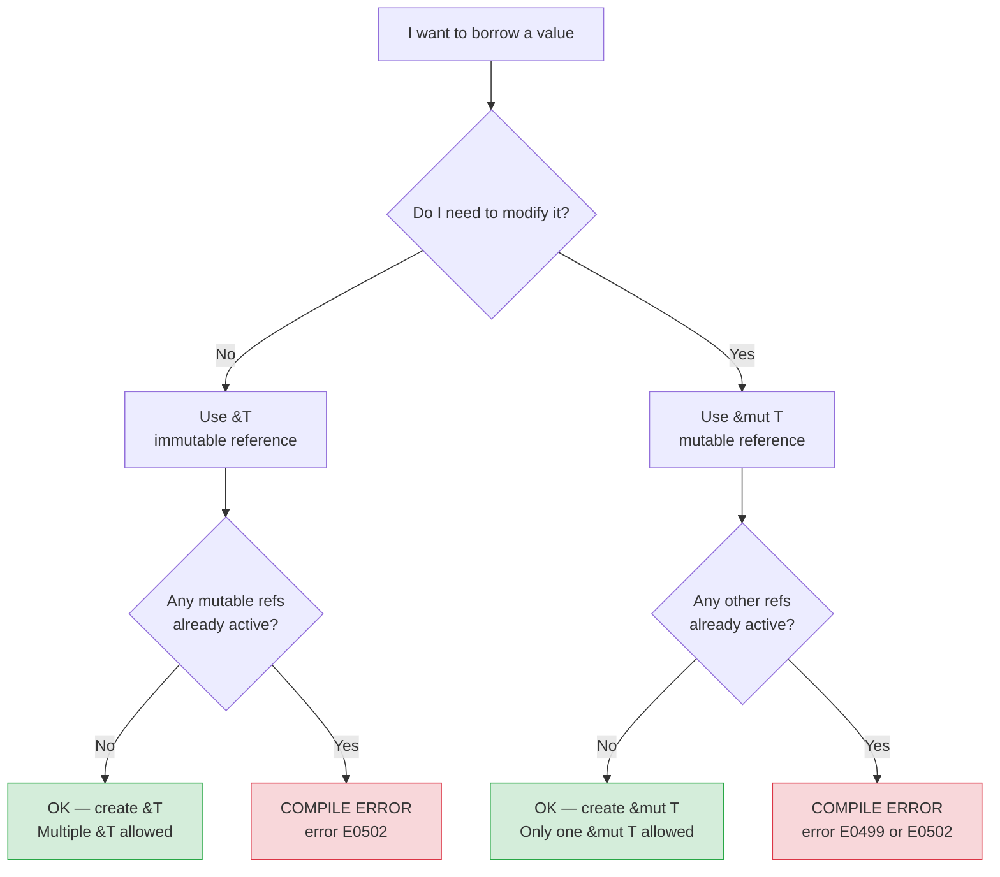

# Borrowing and References

In the last file, you saw that passing a `String` to a function *moves* it — the caller loses ownership. That's fine when you intend to transfer ownership, but most of the time you just want a function to *read* or *modify* a value without taking it. **Borrowing** is the mechanism for this.

Borrowing is like lending a library book. The library (owner) keeps the book. You (the borrower) can read it. But the library has rules — and breaking them is a compile error.

---

## References: The `&` Operator

A **reference** lets you refer to a value without owning it. You create a reference with `&`:

```rust
fn calculate_length(s: &String) -> usize {
    s.len()
}   // s goes out of scope, but since it's a reference (not owner),
    // the String is NOT dropped here

fn main() {
    let s = String::from("hello");
    let len = calculate_length(&s);  // pass a reference
    println!("'{}' has length {}", s, len);  // s is still valid!
}
```

`&s` creates a reference to `s` that *points to* the value without owning it. The function signature `s: &String` says "I accept a reference to a String" — not the String itself.



---

## Immutable References: Many Allowed

A reference created with `&T` is **immutable** — you can read through it but not modify the value. You can have **as many immutable references as you want** at the same time:

```rust
fn main() {
    let s = String::from("hello");

    let r1 = &s;
    let r2 = &s;
    let r3 = &s;
    println!("{}, {}, {}", r1, r2, r3);  // all fine!
}
```

This is safe because no one is modifying the data — everyone is just reading, and concurrent reads are always safe.

---

## Mutable References: Only One at a Time

To modify a value through a reference, you need a **mutable reference** `&mut T`. The rule: **you can have only ONE mutable reference to a value at a time**:

```rust
fn add_exclamation(s: &mut String) {
    s.push_str("!");
}

fn main() {
    let mut s = String::from("hello");  // note: s must be mut too
    add_exclamation(&mut s);
    println!("{}", s);  // "hello!"
}
```

What happens if you try to have two mutable references?

```rust
fn main() {
    let mut s = String::from("hello");
    let r1 = &mut s;
    let r2 = &mut s;  // COMPILE ERROR
    println!("{}, {}", r1, r2);
}
```

```
error[E0499]: cannot borrow `s` as mutable more than once at a time
 --> src/main.rs:4:14
  |
3 |     let r1 = &mut s;
  |              ------ first mutable borrow occurs here
4 |     let r2 = &mut s;
  |              ^^^^^^ second mutable borrow occurs here
5 |     println!("{}, {}", r1, r2);
  |                        -- first borrow later used here
```

> [!NOTE]
> **Why only one mutable reference?** This rule prevents **data races** — situations where two pieces of code modify the same memory at the same time, producing unpredictable results. In Java or Python, data races happen at runtime (and are subtle, hard-to-reproduce bugs). In Rust, they are impossible — the borrow checker catches them at compile time.

---

## The Golden Rule: No Mixing

You also cannot have an immutable reference *and* a mutable reference at the same time:

```rust
fn main() {
    let mut s = String::from("hello");
    let r1 = &s;      // immutable borrow
    let r2 = &s;      // another immutable borrow — fine
    let r3 = &mut s;  // mutable borrow while immutables exist — ERROR!
    println!("{}, {}, {}", r1, r2, r3);
}
```

```
error[E0502]: cannot borrow `s` as mutable because it is also borrowed as immutable
 --> src/main.rs:5:14
  |
3 |     let r1 = &s;
  |              -- immutable borrow occurs here
4 |     let r2 = &s;
5 |     let r3 = &mut s;
  |              ^^^^^^^ mutable borrow occurs here
6 |     println!("{}, {}, {}", r1, r2, r3);
  |                            -- immutable borrow later used here
```

> [!NOTE]
> The rule is simple to remember: **Either many readers, OR one writer — never both at the same time.** This is the same principle used in database read/write locks, except Rust enforces it at compile time automatically.

---

## Can I Borrow This?



---

## NLL: Non-Lexical Lifetimes

Early versions of Rust had a more restrictive rule: a borrow lasted for the entire *lexical* scope (from declaration to closing `}`). This was frustrating. Since **Rust 2018**, the borrow checker uses **Non-Lexical Lifetimes (NLL)** — a borrow lasts only until its *last use*, not the end of its scope:

```rust
fn main() {
    let mut s = String::from("hello");

    let r1 = &s;
    let r2 = &s;
    println!("{} and {}", r1, r2);
    // r1 and r2 are no longer used after this point
    // so the immutable borrows END HERE (even though } is further down)

    let r3 = &mut s;  // now fine — r1 and r2 are no longer active
    r3.push_str(", world");
    println!("{}", r3);
}
```

> [!TIP]
> NLL makes the borrow checker much more ergonomic. If you see borrow checker errors, check whether your reference lifetimes overlap — often restructuring the code slightly (moving a `println!` or adding a block `{}`) resolves the issue without any cloning.

---

## Dangling References: Caught at Compile Time

In C and C++, one of the nastiest bugs is a **dangling pointer** — a pointer that references memory that has already been freed. Rust makes this impossible:

```rust
fn dangle() -> &String {
    let s = String::from("hello");
    &s   // try to return a reference to s
}   // s drops here! The reference would point to freed memory.
```

```
error[E0106]: missing lifetime specifier
 --> src/main.rs:1:16
  |
1 | fn dangle() -> &String {
  |                ^ expected named lifetime parameter
  |
  = help: this function's return type contains a borrowed value,
    but there is no value for it to be borrowed from
```

Rust refuses to compile this. The solution: return the `String` itself (transfer ownership) instead of a reference to it:

```rust
fn no_dangle() -> String {
    let s = String::from("hello");
    s   // move s out — ownership transferred to caller, no dangling ref
}
```

---

## String Slices: A Practical Example of Borrowing

A **string slice** `&str` is a reference to a part of a `String`. It's the most common kind of reference you'll use:

```rust
fn first_word(s: &str) -> &str {
    let bytes = s.as_bytes();
    for (i, &byte) in bytes.iter().enumerate() {
        if byte == b' ' {
            return &s[0..i];  // slice: from index 0 to i (exclusive)
        }
    }
    &s[..]  // whole string as a slice
}

fn main() {
    let sentence = String::from("hello world");
    let word = first_word(&sentence);
    println!("First word: {}", word);
}
```

`&s[0..i]` is a slice — a reference to a portion of the string, without copying. The borrow checker ensures the original `String` stays valid as long as the slice exists.

> [!NOTE]
> **`&str` vs `String`**:
> - `String` — owned, heap-allocated, mutable, growable
> - `&str` — borrowed, a view into some string data (could be in a `String`, or a string literal in the binary)
>
> String literals like `"hello"` have type `&str` — they're references to string data baked into the compiled binary, which has `'static` lifetime (lives for the entire program).

| | `String` | `&str` |
|---|---|---|
| Owned? | Yes | No (borrowed) |
| Heap? | Yes | No (borrows existing data) |
| Mutable? | Yes (if `mut`) | No |
| Use for | Owning/building strings | Viewing/passing strings |
| Python analogy | `str` (all Python strings are heap-owned) | Like a read-only view |

---

## The Library Book Analogy

| Concept | Library book analogy |
|---|---|
| **Owner (`String`)** | The library owns the book |
| **Immutable borrow (`&String`)** | You borrow the book to read — many people can read it at once |
| **Mutable borrow (`&mut String`)** | You check out the book to annotate it — only you can have it, no one else can read it simultaneously |
| **End of borrow** | You return the book — it's available again |
| **Dangling reference** | The library closes and destroys the book while you still hold a reference to it — Rust prevents this |
| **Slice (`&str`)** | You photograph a page — a view of part of the book |

---

## What's Next

In **05_lifetimes.md**, we go deeper into references. When a function takes multiple references as inputs, how does Rust know which reference the output is derived from? **Lifetimes** are the answer — they describe the relationship between how long references are valid, and they're the last piece of the ownership puzzle.
