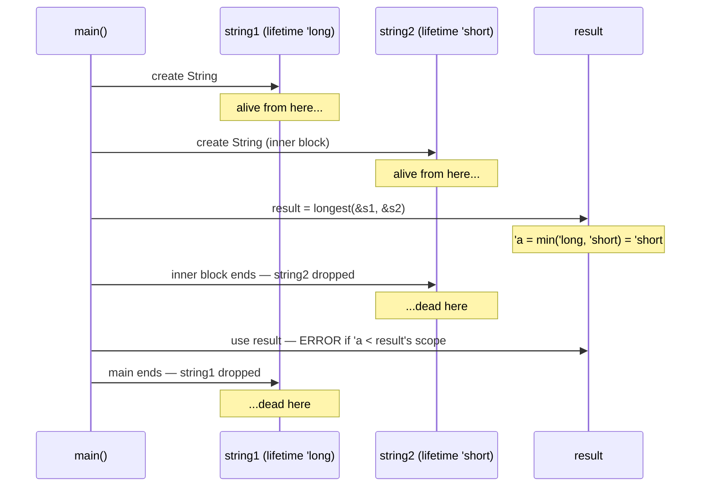
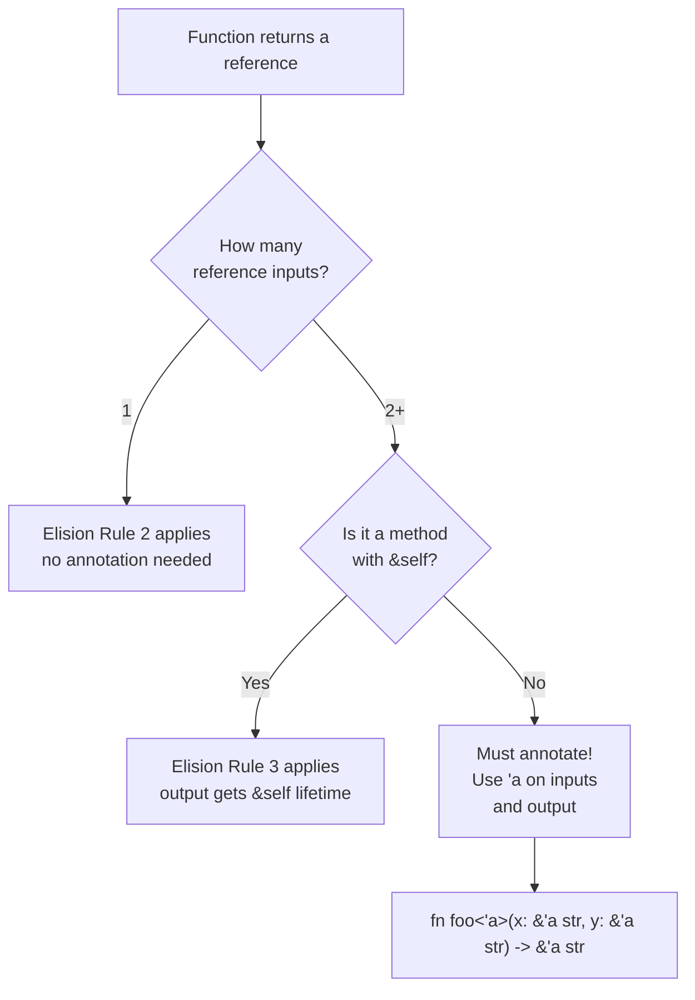

# Lifetimes

You now know that Rust prevents dangling references — references to memory that has been freed. For simple cases, the compiler can figure this out automatically. But for functions that take *multiple references* as input and return *one reference* as output, the compiler needs help: **which input reference does the output come from?** If the output outlives its source, we have a dangling reference.

**Lifetimes** are the mechanism for answering this question. They describe relationships between how long references are valid — and they're the final piece of the ownership puzzle.

---

## The Problem: Where Does This Reference Come From?

Consider a function that returns the longer of two string slices:

```rust
fn longest(x: &str, y: &str) -> &str {
    if x.len() > y.len() {
        x
    } else {
        y
    }
}
```

This looks reasonable. But the compiler refuses it:

```
error[E0106]: missing lifetime specifier
 --> src/main.rs:1:33
  |
1 | fn longest(x: &str, y: &str) -> &str {
  |               ----     ----     ^ expected named lifetime parameter
  |
  = help: this function's return type contains a borrowed value,
    but the signature does not say whether it is borrowed from `x` or `y`
```

The compiler's concern is valid. Consider this calling code:

```rust
fn main() {
    let result;
    let string1 = String::from("long string");
    {
        let string2 = String::from("xy");
        result = longest(string1.as_str(), string2.as_str());
        // result might refer to string2, which is about to be dropped!
    }
    println!("Longest: {}", result);  // is this safe?
}
```

The compiler doesn't know whether `result` refers to `string1` or `string2`. If it refers to `string2`, it's a dangling reference after the inner block ends. Lifetime annotations let us tell the compiler the relationship.

---

## Lifetime Annotation Syntax

Lifetime annotations use a tick followed by a name: `'a`, `'b`, `'long`, etc. By convention, single lowercase letters like `'a` are used. They go **after** the `&`:

```
&i32          — a reference (no lifetime annotation)
&'a i32       — a reference with lifetime 'a
&'a mut i32   — a mutable reference with lifetime 'a
```

> [!NOTE]
> Lifetime annotations do **not** change how long any reference actually lives. They describe the *relationship* between the lifetimes of multiple references. Think of them as type annotations for time rather than for data.

---

## The `longest` Function with Lifetime Annotations

```rust
fn longest<'a>(x: &'a str, y: &'a str) -> &'a str {
    if x.len() > y.len() {
        x
    } else {
        y
    }
}
```

The syntax `<'a>` declares a lifetime parameter (like a generic type parameter). The signature now says: "given two string slices that both live at least as long as `'a`, return a string slice that lives at least as long as `'a`."

In practice, `'a` will be the *shorter* of the two input lifetimes — the output is guaranteed to be valid for that duration.

Now the compiler can validate call sites:

```rust
fn main() {
    let string1 = String::from("long string is long");

    {
        let string2 = String::from("xyz");
        let result = longest(string1.as_str(), string2.as_str());
        println!("Longest: {}", result);  // OK — result used inside this block
    }
}
```

And this correctly fails:

```rust
fn main() {
    let result;
    let string1 = String::from("long string is long");
    {
        let string2 = String::from("xyz");
        result = longest(string1.as_str(), string2.as_str());
    }   // string2 dropped here
    println!("Longest: {}", result);  // ERROR — result might dangle
}
```

```
error[E0597]: `string2` does not live long enough
 --> src/main.rs:6:44
  |
6 |         result = longest(string1.as_str(), string2.as_str());
  |                                            ^^^^^^^^^^^^^^^^ borrowed value does not live long enough
7 |     }
  |     - `string2` dropped here while still borrowed
8 |     println!("Longest: {}", result);
  |                             ------ borrow later used here
```

The lifetime annotation told the compiler what it needed to know, and the compiler correctly caught the bug.

---

## Lifetimes as Scope Relationships

A sequence diagram helps visualise what lifetimes actually describe:



---

## Lifetimes in Structs

If a struct holds a reference, it needs a lifetime annotation:

```rust
struct ImportantExcerpt<'a> {
    part: &'a str,
}

fn main() {
    let novel = String::from("Call me Ishmael. Some years ago...");
    let first_sentence;
    {
        let i = novel.find('.').unwrap_or(novel.len());
        first_sentence = &novel[..i];
    }
    let excerpt = ImportantExcerpt {
        part: first_sentence,
    };
    println!("{}", excerpt.part);
}
```

The annotation `<'a>` on `ImportantExcerpt` means: "an instance of this struct cannot outlive the reference it holds in `part`." The compiler ensures this automatically.

> [!WARNING]
> If you find yourself putting references in structs frequently in early Rust code, consider whether you should use an **owned** type instead. `part: String` (owned) is often simpler than `part: &'a str` (borrowed), at the cost of a heap allocation. Many beginner Rust pain points dissolve by just owning the data.

---

## Lifetime Elision: When You Don't Need to Write Them

You may have noticed that many functions use references without lifetime annotations and still compile:

```rust
fn first_word(s: &str) -> &str {
    let bytes = s.as_bytes();
    for (i, &byte) in bytes.iter().enumerate() {
        if byte == b' ' {
            return &s[0..i];
        }
    }
    &s[..]
}
```

This function has no lifetime annotations but returns a reference. How? Because of **lifetime elision** — a set of rules the compiler applies automatically when the relationship is unambiguous:

| Rule | Applies to | What it does |
|---|---|---|
| **Rule 1** | Input references | Each input reference gets its own distinct lifetime: `fn foo(x: &str, y: &str)` → `fn foo<'a,'b>(x: &'a str, y: &'b str)` |
| **Rule 2** | Output reference (one input) | If there is exactly one input reference, the output gets that same lifetime: `fn foo(x: &str) -> &str` → `fn foo<'a>(x: &'a str) -> &'a str` |
| **Rule 3** | Methods (`&self`/`&mut self`) | If one of the inputs is `&self` or `&mut self`, the output gets the lifetime of `self` |

For `first_word`: Rule 1 gives `s` its own lifetime `'a`. Rule 2 says the one input reference (`s`) gives its lifetime to the output. Result: `fn first_word<'a>(s: &'a str) -> &'a str` — fully resolved without you writing a thing.

If the rules *don't* resolve fully (as in `longest` with two inputs), the compiler asks you to be explicit. This is not a flaw — it's the compiler telling you "I can't infer the relationship; help me out."

---

## The `'static` Lifetime

`'static` is a special lifetime meaning "this reference is valid for the entire duration of the program":

```rust
let s: &'static str = "I am static";
```

String literals have `'static` lifetime because they are baked into the compiled binary and live forever.

> [!WARNING]
> You may see compiler messages suggesting you add `'static` to fix a lifetime error. Before doing so, ask yourself: **does this value actually need to live for the entire program?** Often the answer is no — and the real fix is to restructure ownership or use an owned type. Using `'static` as a hammer to silence the compiler is a code smell.

Legitimate uses of `'static`:
- String literals and constants
- Types that contain no references (they trivially satisfy `'static`)
- Thread-spawning: `std::thread::spawn` requires `'static` because the thread might outlive the current scope

---

## Putting It All Together: Generic Types, Traits, and Lifetimes

Rust lets you combine all three in a single function signature:

```rust
use std::fmt::Display;

fn longest_with_announcement<'a, T>(
    x: &'a str,
    y: &'a str,
    ann: T,
) -> &'a str
where
    T: Display,
{
    println!("Announcement: {}", ann);
    if x.len() > y.len() { x } else { y }
}
```

This function: takes two string slices with lifetime `'a`, takes a third parameter of any type `T` that can be displayed, prints the announcement, and returns a reference with lifetime `'a`. This is full-power idiomatic Rust — you'll write functions like this naturally once ownership and lifetimes click.

---

## Key Insight

> [!NOTE]
> **The most important thing to understand about lifetimes:**
>
> Lifetime annotations do not *change* how long anything lives. They *describe* relationships that already exist, so the compiler can verify them. You are not telling Rust "make this live longer" — you are telling Rust "this output comes from this input, so check that the input outlives the output."
>
> If the compiler's analysis of your actual code doesn't match the relationship you've described, it's a compile error — which means it's a bug you've avoided shipping.

---

## Lifetime Cheat Sheet



---

## What's Next

With ownership, borrowing, and lifetimes under your belt, you've cleared the steepest part of the Rust learning curve. The next files cover **structs and enums** (Rust's data modelling tools), then **error handling** with `Result<T, E>` and `Option<T>`, then traits (Rust's answer to interfaces), and finally generics and iterators. The hard conceptual work is done — from here, it gets progressively more rewarding.
