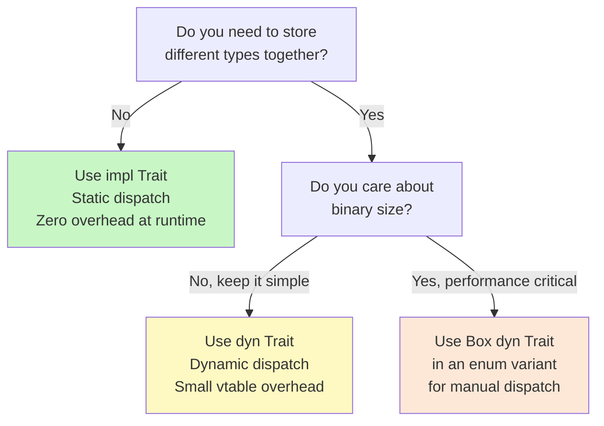

Every real program needs to write code that works across multiple types without duplicating logic. In Java you reach for interfaces and generics. In Python you rely on duck typing. Rust offers both **traits** (a precise definition of behaviour that a type must provide) and **generics** (code that is parameterised over types). Together they give you zero-cost abstraction — the flexibility of dynamic languages with the performance of C.

---

## Traits — Defining Shared Behaviour

A **trait** is a contract: "any type that implements this trait promises to provide these methods." Think of it as a Java `interface` or a Python Protocol.

```rust
trait Greet {
    fn greet(&self) -> String;
}
```

Any type can fulfil this contract with `impl Trait for Type`:

```rust
struct Human {
    name: String,
}

struct Robot {
    model: String,
}

impl Greet for Human {
    fn greet(&self) -> String {
        format!("Hi, I'm {}!", self.name)
    }
}

impl Greet for Robot {
    fn greet(&self) -> String {
        format!("BEEP. Unit {} online.", self.model)
    }
}

fn main() {
    let h = Human { name: String::from("Alice") };
    let r = Robot { model: String::from("R2D2") };
    println!("{}", h.greet());
    println!("{}", r.greet());
}
```

### Default Method Implementations

A trait can provide a default body. Types that implement the trait can override it or use the default:

```rust
trait Describe {
    fn type_name(&self) -> &str;

    // Default implementation calls type_name
    fn describe(&self) -> String {
        format!("I am a {}", self.type_name())
    }
}

struct Cat;
impl Describe for Cat {
    fn type_name(&self) -> &str { "cat" }
    // describe() is inherited — no override needed
}
```

### The Orphan Rule

> [!WARNING]
> **You cannot implement an external trait on an external type.** Both the trait and the type must belong to your crate (your project) for the `impl` to be legal.

```rust
// ERROR: both Vec and Display belong to the standard library, not your crate
// impl std::fmt::Display for Vec<i32> { ... }  // won't compile

// ALLOWED: your trait on an external type
trait MyPrint { fn my_print(&self); }
impl MyPrint for Vec<i32> { ... }  // fine — MyPrint is yours

// ALLOWED: external trait on your type
struct MyType;
impl std::fmt::Display for MyType { ... }  // fine — MyType is yours
```

This rule ensures that two libraries never accidentally provide conflicting implementations of the same trait for the same type.

---

## Generics — One Function for Many Types

Generics let you write a function or struct *once* and use it with any compatible type.

### Generic Functions

```rust
// Without generics: must write one for i32, one for f64, etc.
fn largest_i32(list: &[i32]) -> &i32 { ... }

// With generics: works for anything that supports comparison
fn largest<T: PartialOrd>(list: &[T]) -> &T {
    let mut largest = &list[0];
    for item in list {
        if item > largest {
            largest = item;
        }
    }
    largest
}

fn main() {
    let numbers = vec![34, 50, 25, 100, 65];
    println!("Largest number: {}", largest(&numbers));

    let chars = vec!['y', 'm', 'a', 'q'];
    println!("Largest char: {}", largest(&chars));
}
```

`T: PartialOrd` is a **trait bound** — it says "T must implement the PartialOrd trait (support `<` and `>`)".

### Generic Structs

```rust
// A point that holds any type of coordinate
struct Point<T> {
    x: T,
    y: T,
}

// A point where x and y can be different types
struct MixedPoint<T, U> {
    x: T,
    y: U,
}

fn main() {
    let int_point = Point { x: 5, y: 10 };
    let float_point = Point { x: 1.5, y: 2.7 };
    let mixed = MixedPoint { x: 5, y: 4.0 };
}
```

### `impl` with Generics

```rust
impl<T> Point<T> {
    fn x(&self) -> &T {
        &self.x
    }
}

// You can also implement methods only for a specific concrete type:
impl Point<f64> {
    fn distance_from_origin(&self) -> f64 {
        (self.x.powi(2) + self.y.powi(2)).sqrt()
    }
}
```

### The `where` Clause — Readability for Complex Bounds

When a function has many type parameters and bounds, the signature can get crowded. Move the bounds to a `where` clause:

```rust
// Hard to read
fn process<T: Clone + std::fmt::Debug, U: std::fmt::Display + PartialOrd>(t: T, u: U) { ... }

// Much cleaner with where
fn process<T, U>(t: T, u: U)
where
    T: Clone + std::fmt::Debug,
    U: std::fmt::Display + PartialOrd,
{ ... }
```

---

## `impl Trait` vs `dyn Trait` — Static vs Dynamic Dispatch

This is one of Rust's more nuanced topics. When a function accepts a trait, you have two syntaxes:

```rust
// Static dispatch — resolved at compile time
fn notify_static(item: &impl Greet) {
    println!("{}", item.greet());
}

// Dynamic dispatch — resolved at runtime via vtable
fn notify_dynamic(item: &dyn Greet) {
    println!("{}", item.greet());
}
```



| | `impl Trait` (static) | `dyn Trait` (dynamic) |
|---|---|---|
| **Dispatch** | Compile-time monomorphization | Runtime vtable lookup |
| **Performance** | Zero overhead | Small indirection cost |
| **Binary size** | Larger (one copy per type) | Smaller (one code path) |
| **Heterogeneous collections** | Not possible | `Vec<Box<dyn Trait>>` |
| **Analogy** | C++ templates | Java interfaces/polymorphism |

> [!NOTE]
> **Monomorphization** means the compiler generates a separate concrete version of the function for each type it is called with — like C++ template instantiation. You get the flexibility of generics with zero runtime cost.

---

## Key Standard Library Traits

These traits appear everywhere in Rust code. Understanding them unlocks the standard library.

| Trait | What it means | Derive? | Example |
|-------|--------------|---------|---------|
| `Display` | Human-readable `{}` formatting | No | `impl fmt::Display for MyType` |
| `Debug` | Debug `{:?}` formatting | Yes (`#[derive(Debug)]`) | Print structs during development |
| `Clone` | Explicit deep copy | Yes | `let b = a.clone()` |
| `Copy` | Implicit bitwise copy (no move) | Yes (if all fields are Copy) | `i32`, `f64`, `bool` |
| `PartialOrd` / `Ord` | Comparison with `<`, `>` | Yes | Sorting, `max()`, `min()` |
| `Iterator` | Enables `for` loops and adapters | No (manual impl) | Custom sequences |
| `From` / `Into` | Type conversions | Automatic (`Into` from `From`) | `String::from("hello")` |
| `Default` | A sensible "zero" value | Yes | `Vec::default()` → empty vec |

### Deriving Traits Automatically

The `#[derive(...)]` attribute auto-generates trait implementations for common cases:

```rust
#[derive(Debug, Clone, PartialEq)]
struct User {
    name: String,
    age: u32,
}

fn main() {
    let user = User { name: String::from("Alice"), age: 30 };
    println!("{:?}", user);           // uses Debug
    let user2 = user.clone();         // uses Clone
    println!("{}", user == user2);    // uses PartialEq → true
}
```

> [!TIP]
> Start every new struct with `#[derive(Debug)]`. It costs nothing and saves enormous pain during development — you can print any struct value immediately.

---

## Putting It Together — A Practical Example

```rust
use std::fmt;

trait Summary {
    fn summarise(&self) -> String;
    fn author(&self) -> String {
        String::from("(anonymous)")
    }
}

#[derive(Debug)]
struct Article {
    title: String,
    author: String,
    content: String,
}

impl Summary for Article {
    fn summarise(&self) -> String {
        format!("{}, by {}", self.title, self.author)
    }
    fn author(&self) -> String {
        self.author.clone()
    }
}

impl fmt::Display for Article {
    fn fmt(&self, f: &mut fmt::Formatter) -> fmt::Result {
        write!(f, "{} ({})", self.title, self.author)
    }
}

// Generic function: works for any type that implements Summary
fn notify<T: Summary>(item: &T) {
    println!("Breaking news! {}", item.summarise());
}
```

---

## What's Next

Traits and generics let you write flexible, reusable code. But real programs fail — files go missing, networks time out, inputs are malformed. The next file, `08_error-handling.md`, shows how Rust turns errors into values you must explicitly handle, making your programs dramatically more reliable.
