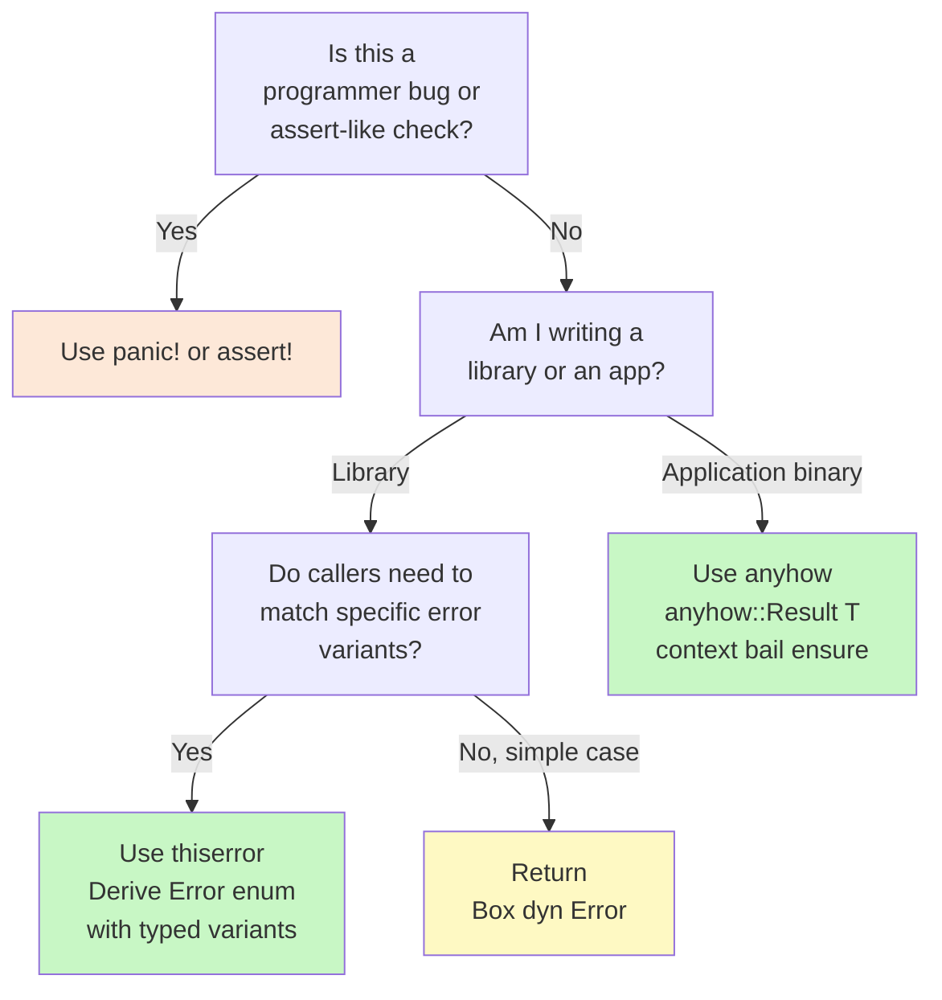

Every program encounters failure. Files don't exist, network connections drop, user input is malformed. The question isn't *whether* to handle errors — it's *how*. Java and Python use exceptions that can be thrown from anywhere and caught (or not) anywhere, making it hard to know which functions can fail. Rust takes a radically different stance: **errors are values**. A function that can fail says so in its return type, and the compiler ensures you deal with the possibility.

---

## Rust's Philosophy: No Exceptions

In Java and Python, a function can throw an exception at any point without this being visible in its signature. You need to read the documentation — or get surprised at runtime — to know what can fail.

```python
# Python — no indication this can fail in the signature
def read_config(path: str) -> dict:
    with open(path) as f:       # FileNotFoundError? Who knows
        return json.load(f)     # json.JSONDecodeError? Surprise!
```

In Rust, the return type *is* the documentation:

```rust
// Rust — the return type tells you exactly that this can fail
fn read_config(path: &str) -> Result<Config, std::io::Error> {
    // ...
}
```

---

## `panic!` — Unrecoverable Errors

`panic!` is Rust's last resort. It immediately terminates the current thread with an error message and a stack trace. Use it only for:

- **Programmer bugs** — situations that "should never happen" (like an out-of-bounds array index)
- **Unrecoverable failures** — when the program genuinely cannot continue

```rust
fn divide(a: i32, b: i32) -> i32 {
    if b == 0 {
        panic!("Division by zero — this is a bug in the caller!");
    }
    a / b
}
```

> [!WARNING]
> **Do not use `panic!` for expected failure cases** (missing files, bad user input, network timeouts). Those are recoverable situations — use `Result` instead. `panic!` in a library is especially bad: it crashes the *caller's* program without giving them a chance to recover.

---

## `Result<T, E>` — The Two Paths

`Result` is an enum with two variants:

```rust
enum Result<T, E> {
    Ok(T),   // success — contains the value T
    Err(E),  // failure — contains the error E
}
```

Every fallible standard library operation returns a `Result`. Reading a file:

```rust
use std::fs;

fn main() {
    let result = fs::read_to_string("config.toml");

    match result {
        Ok(contents) => println!("File contents:\n{}", contents),
        Err(e) => eprintln!("Failed to read file: {}", e),
    }
}
```

---

## The `?` Operator — Propagating Errors Elegantly

Manually matching every `Result` gets tedious when you call multiple fallible functions. The `?` operator is syntactic sugar: if the value is `Ok(v)`, unwrap it to `v`; if it is `Err(e)`, **return early** from the current function with that error.

### Before `?`

```rust
use std::fs;
use std::io;

fn read_username() -> Result<String, io::Error> {
    let result = fs::read_to_string("username.txt");
    let s = match result {
        Ok(s) => s,
        Err(e) => return Err(e),
    };
    Ok(s.trim().to_string())
}
```

### After `?`

```rust
fn read_username() -> Result<String, io::Error> {
    let s = fs::read_to_string("username.txt")?;
    Ok(s.trim().to_string())
}
```

> [!NOTE]
> The `?` operator also performs an **automatic type conversion** using the `From` trait. If your function returns `Result<T, MyError>` and a sub-call returns `Result<T, io::Error>`, Rust will call `MyError::from(io_error)` automatically — as long as you've implemented `From<io::Error> for MyError`. This is how `thiserror`'s `#[from]` attribute works.

You can chain `?` operators across multiple calls:

```rust
fn process_data(path: &str) -> Result<Vec<u32>, Box<dyn std::error::Error>> {
    let content = fs::read_to_string(path)?;
    let numbers: Vec<u32> = content
        .lines()
        .map(|l| l.trim().parse::<u32>())
        .collect::<Result<Vec<_>, _>>()?;
    Ok(numbers)
}
```

---

## `unwrap()` and `expect()` — Shortcuts with a Cost

`unwrap()` extracts the `Ok` value or panics if it is `Err`. `expect("message")` does the same but with a custom panic message.

```rust
let contents = fs::read_to_string("config.toml").unwrap();
let contents = fs::read_to_string("config.toml").expect("config.toml must exist");
```

> [!WARNING]
> **Use `unwrap()` and `expect()` only in:** tests, quick prototypes, or when you have already proven the value cannot be `Err` (and can explain why in a comment). Never use them in production library code — a panic in a library will crash the caller's entire program.

---

## Error Handling in Practice: Two Libraries

The Rust ecosystem has converged on two complementary crates for error handling:

### `thiserror` — For Library Crates

When you are building a library, your users need to be able to match on specific error variants. `thiserror` uses derive macros to generate `std::error::Error` implementations:

```rust
use thiserror::Error;

#[derive(Debug, Error)]
pub enum AppError {
    #[error("file not found: {path}")]
    FileNotFound { path: String },

    #[error("parse error: {0}")]
    ParseError(String),

    // #[from] auto-generates From<io::Error> for AppError
    #[error("I/O error")]
    Io(#[from] std::io::Error),
}

fn read_config(path: &str) -> Result<String, AppError> {
    let content = std::fs::read_to_string(path)?;  // io::Error auto-converted
    Ok(content)
}
```

### `anyhow` — For Application Crates

When you are writing an application (a binary), you usually don't need callers to match on error variants — you just want to display a useful message and exit. `anyhow` gives you a single flexible `Result` type:

```rust
use anyhow::{Result, Context, bail, ensure};

fn run(path: &str) -> Result<()> {
    let content = std::fs::read_to_string(path)
        .with_context(|| format!("Failed to open config file: {}", path))?;

    let value: i32 = content.trim().parse()
        .context("Config file must contain an integer")?;

    ensure!(value > 0, "Value must be positive, got {}", value);

    if value > 1000 {
        bail!("Value {} is unreasonably large", value);
    }

    println!("Config value: {}", value);
    Ok(())
}
```

`anyhow` macros:
- `.context("msg")` / `.with_context(|| ...)` — add context to any error
- `bail!("msg")` — return an `Err` immediately (like `throw` in Java)
- `ensure!(condition, "msg")` — return `Err` if condition is false (like `assert` but returning not panicking)

---

## Decision Flowchart



---

## Language Comparison: Error Handling Philosophies

| Feature | Java | Python | Rust |
|---------|------|--------|------|
| Mechanism | Checked + unchecked exceptions | Exceptions (`try`/`except`) | Return values (`Result<T,E>`) |
| Visible in signature? | Partially (checked exceptions) | No | **Always** |
| Can you ignore an error? | Yes (unchecked) | Yes (silent except) | Compiler warns if `Result` unused |
| Stack unwinding | Yes | Yes | Only with `panic!` |
| Error chaining | `initCause()` | `raise X from Y` | `.context()` (anyhow) / `#[from]` |
| Library recommended | — | — | `thiserror` (lib) / `anyhow` (app) |

> [!TIP]
> A good rule of thumb: if you are writing code that others will depend on as a library, use `thiserror`. If you are writing the final application that users run, use `anyhow`. Many projects use both — `thiserror` in internal modules, `anyhow` at the top-level `main.rs`.

---

## What's Next

You can now write Rust programs that model data (structs/enums), share behaviour (traits/generics), and handle failures gracefully (Result/`?`). The final technical file — `09_advanced-patterns.md` — covers the remaining power tools: closures, iterators, smart pointers, and concurrency. These complete the picture of what makes Rust uniquely capable.
