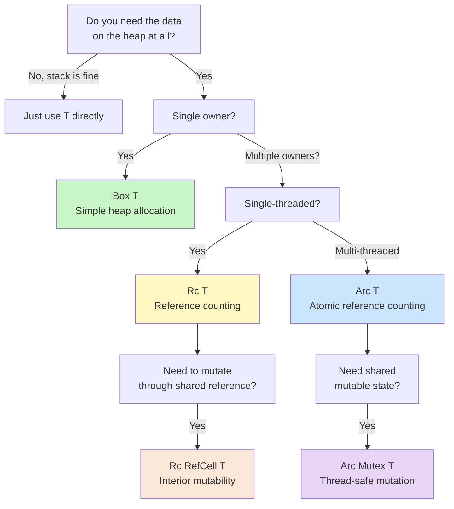

This is the final technical chapter of your Rust journey. You have already learned ownership, borrowing, structs, enums, traits, generics, and error handling — the foundations. Now we climb to the advanced patterns that make Rust code both expressive and fast: **closures** (anonymous functions that capture their environment), **iterators** (lazy, composable sequences), **smart pointers** (types that own heap data with specific sharing rules), and **concurrency** (threads and async/await). By the end you will understand why Rust programmers so often describe the language as "once it compiles, it works."

---

## Closures — Anonymous Functions That Remember Their Context

A **closure** is an anonymous function that can capture variables from the scope around it. Python developers know them as `lambda` (limited to one expression) or nested functions. Java developers know them as lambdas introduced in Java 8.

```rust
let add = |x: i32, y: i32| x + y;
println!("{}", add(3, 4));  // 7

// Types can often be inferred
let multiply = |x, y| x * y;
println!("{}", multiply(3, 4));  // 12
```

### How Closures Capture Variables

Rust closures can capture in three ways, tried in order (least powerful first):

```rust
let text = String::from("hello");

// 1. By immutable reference — read-only borrow
let print_it = || println!("{}", text);
print_it();  // text still valid

// 2. By mutable reference — needs `mut` closure
let mut count = 0;
let mut increment = || { count += 1; };
increment();
increment();
println!("{}", count);  // 2

// 3. By value (move) — closure takes ownership
let name = String::from("Alice");
let greet = move || println!("Hello, {}!", name);
greet();
// name is no longer accessible here — moved into closure
```

The `move` keyword forces a closure to take ownership of captured variables. This is essential when passing closures to threads (so the closure outlives the current stack frame).

### The `Fn` Trait Hierarchy

| Trait | Closure can be called | Can capture |
|-------|----------------------|-------------|
| `FnOnce` | Once only (consumes captured values) | By value (move) |
| `FnMut` | Multiple times, mutating captures | By mutable reference |
| `Fn` | Multiple times, no mutation | By immutable reference or Copy |

`FnOnce ⊇ FnMut ⊇ Fn` — every `Fn` is also an `FnMut` and an `FnOnce`. When accepting a closure as a parameter, use the least restrictive bound that works:

```rust
fn apply_twice<F: Fn(i32) -> i32>(f: F, x: i32) -> i32 {
    f(f(x))  // called twice — needs Fn, not FnOnce
}
println!("{}", apply_twice(|x| x + 3, 5));  // 11
```

---

## Iterators — Lazy, Composable, Zero-Cost

An **iterator** is any type that implements the `Iterator` trait — specifically, a `next()` method that returns `Option<Item>`. Iterators are **lazy**: no work happens until you consume them.

### Creating Iterators

```rust
let v = vec![1, 2, 3, 4, 5];

let iter1 = v.iter();        // yields &i32 — borrows elements
let iter2 = v.into_iter();   // yields i32  — consumes v (moves elements)
let mut v2 = vec![1, 2, 3];
let iter3 = v2.iter_mut();   // yields &mut i32 — mutable borrow
```

### Common Iterator Adapters

```rust
let numbers = vec![1, 2, 3, 4, 5, 6, 7, 8];

// map: transform each element
let doubled: Vec<i32> = numbers.iter().map(|x| x * 2).collect();

// filter: keep only matching elements
let evens: Vec<&i32> = numbers.iter().filter(|&&x| x % 2 == 0).collect();

// take / skip: first N or skip first N
let first_three: Vec<&i32> = numbers.iter().take(3).collect();
let after_two: Vec<&i32> = numbers.iter().skip(2).collect();

// chain: concatenate two iterators
let a = [1, 2];
let b = [3, 4];
let combined: Vec<i32> = a.iter().chain(b.iter()).copied().collect();

// enumerate: pair each element with its index
for (i, val) in numbers.iter().enumerate() {
    println!("numbers[{}] = {}", i, val);
}

// fold / sum / product: reduce to a single value
let total: i32 = numbers.iter().sum();
let product: i32 = numbers.iter().product();
```

### Real Example: Sum of Squares of Even Numbers

```rust
let data = vec![1, 2, 3, 4, 5, 6, 7, 8, 9, 10];

// Imperative style (like Python/Java before streams)
let mut sum_imperative = 0;
for &x in &data {
    if x % 2 == 0 {
        sum_imperative += x * x;
    }
}

// Iterator chain — same logic, more readable
let sum_iterator: i32 = data.iter()
    .filter(|&&x| x % 2 == 0)
    .map(|&x| x * x)
    .sum();

assert_eq!(sum_imperative, sum_iterator);  // both = 220
```

> [!NOTE]
> **Zero-cost abstraction**: the iterator chain compiles to the same machine code as the imperative loop. The compiler inlines everything. You pay no runtime cost for the expressive syntax.

---

## Smart Pointers — Controlling Heap Ownership

Rust's ownership system is strict by default: one owner, compile-time borrows. Smart pointers are types that *wrap* heap-allocated data and add additional semantics — multiple owners, interior mutability, or thread-safety.



### Smart Pointer Decision Table

| Type | Ownership | Thread-safe | Borrow checking | Use case |
|------|-----------|-------------|-----------------|----------|
| `Box<T>` | Single | N/A | Compile-time | Heap allocation, recursive types |
| `Rc<T>` | Multiple | No | Compile-time | Shared read-only data, single thread |
| `Arc<T>` | Multiple | Yes | Compile-time | Shared read-only data, multi-thread |
| `RefCell<T>` | Single | No | **Runtime** | Interior mutability, single thread |
| `Mutex<T>` | Multiple (via `Arc`) | Yes | **Runtime (lock)** | Shared mutable state, multi-thread |

### `Box<T>` — Simple Heap Allocation

```rust
// Stack by default
let x = 5;

// Heap via Box
let y = Box::new(5);
println!("{}", y);  // works like a normal value
// y is automatically freed when it goes out of scope

// Recursive type — must use Box to give it a known size
enum List {
    Cons(i32, Box<List>),
    Nil,
}

let list = List::Cons(1, Box::new(List::Cons(2, Box::new(List::Nil))));
```

### `Rc<T>` — Multiple Owners (Single-Threaded)

`Rc` (Reference Counted) allows multiple read-only owners. The value is freed when the last `Rc` is dropped.

```rust
use std::rc::Rc;

let shared = Rc::new(String::from("hello"));
let clone1 = Rc::clone(&shared);  // increments reference count
let clone2 = Rc::clone(&shared);

println!("Count: {}", Rc::strong_count(&shared));  // 3
println!("{} {} {}", shared, clone1, clone2);
// All three dropped at end of scope → count → 0 → value freed
```

### `Arc<T>` — Multi-Threaded Reference Counting

`Arc` (Atomically Reference Counted) is `Rc` but safe to share across threads. The atomic operations make it slightly slower than `Rc`, so use `Rc` in single-threaded code and `Arc` when crossing thread boundaries.

```rust
use std::sync::Arc;
use std::thread;

let data = Arc::new(vec![1, 2, 3]);

let data_clone = Arc::clone(&data);
let handle = thread::spawn(move || {
    println!("From thread: {:?}", data_clone);
});
handle.join().unwrap();
println!("From main: {:?}", data);
```

### `RefCell<T>` — Interior Mutability

`RefCell` lets you mutate data even when you only hold an immutable reference. The borrow rules are enforced **at runtime** (panicking if violated) rather than compile time.

```rust
use std::cell::RefCell;

let data = RefCell::new(vec![1, 2, 3]);

// borrow() gives a shared Ref (like &)
println!("{:?}", data.borrow());

// borrow_mut() gives a mutable RefMut (like &mut)
data.borrow_mut().push(4);
println!("{:?}", data.borrow());  // [1, 2, 3, 4]
```

The common `Rc<RefCell<T>>` pattern gives you multiple owners *and* the ability to mutate:

```rust
use std::rc::Rc;
use std::cell::RefCell;

let shared_vec = Rc::new(RefCell::new(vec![1, 2]));
let clone = Rc::clone(&shared_vec);

shared_vec.borrow_mut().push(3);
clone.borrow_mut().push(4);

println!("{:?}", shared_vec.borrow());  // [1, 2, 3, 4]
```

### `Mutex<T>` — Thread-Safe Mutation

`Mutex` (Mutual Exclusion) ensures only one thread accesses the data at a time. Always used inside `Arc` for shared ownership:

```rust
use std::sync::{Arc, Mutex};
use std::thread;

let counter = Arc::new(Mutex::new(0));
let mut handles = vec![];

for _ in 0..10 {
    let counter_clone = Arc::clone(&counter);
    let handle = thread::spawn(move || {
        let mut num = counter_clone.lock().unwrap();
        *num += 1;  // lock released when `num` drops at end of scope
    });
    handles.push(handle);
}

for handle in handles { handle.join().unwrap(); }
println!("Result: {}", *counter.lock().unwrap());  // 10
```

---

## Threads — Fearless Concurrency

```rust
use std::thread;
use std::time::Duration;

let handle = thread::spawn(|| {
    for i in 1..=5 {
        println!("spawned thread: {}", i);
        thread::sleep(Duration::from_millis(1));
    }
});

for i in 1..=3 {
    println!("main thread: {}", i);
    thread::sleep(Duration::from_millis(1));
}

handle.join().unwrap();  // wait for spawned thread to finish
```

`thread::spawn` returns a `JoinHandle`. Call `.join()` to block until the thread completes. The `move` keyword in the closure is essential when passing owned data into a thread — the closure must own its captures because it may outlive the current scope.

> [!NOTE]
> Rust's ownership system gives you **compile-time data race prevention**. If two threads could access the same data simultaneously without synchronisation, the code won't compile. This is the "fearless concurrency" Rust is famous for.

---

## Async/Await — Concurrency Without Threads

Threads are expensive (each carries an OS-managed stack of ~8MB). **Async** lets you write concurrent code that runs on a small pool of OS threads, with the runtime multiplexing thousands of lightweight tasks.

### Core Concepts

An `async fn` returns a **Future** — a value that represents a computation not yet complete. Futures are **lazy**: they do nothing until someone `.await`s them (or the runtime polls them).

```rust
// Declare an async function
async fn fetch_data(url: &str) -> Result<String, reqwest::Error> {
    let response = reqwest::get(url).await?;
    let text = response.text().await?;
    Ok(text)
}
```

### You Need a Runtime

Rust's standard library defines the `Future` trait but does not include a runtime. You need an external crate. **Tokio** is the de-facto standard:

Add to `Cargo.toml`:
```toml
[dependencies]
tokio = { version = "1", features = ["full"] }
reqwest = { version = "0.12", features = ["json"] }
```

```rust
#[tokio::main]
async fn main() {
    match fetch_data("https://httpbin.org/get").await {
        Ok(body) => println!("{}", body),
        Err(e) => eprintln!("Error: {}", e),
    }
}
```

`#[tokio::main]` is a macro that transforms `async fn main()` into a regular `fn main()` that starts the Tokio runtime and runs your async code inside it.

### Running Multiple Async Tasks Concurrently

```rust
use tokio::time::{sleep, Duration};

async fn task(id: u32) {
    println!("Task {} starting", id);
    sleep(Duration::from_millis(100)).await;
    println!("Task {} done", id);
}

#[tokio::main]
async fn main() {
    // Run both tasks concurrently (not sequentially)
    let (r1, r2) = tokio::join!(task(1), task(2));
}
```

> [!TIP]
> A common source of confusion: `async` functions look sequential but are concurrent — `tokio::join!` runs both tasks at the same time. If you call `task(1).await` followed by `task(2).await` without `join!`, they run **sequentially** (200ms total instead of 100ms).

---

## You've Made It!

You have now traversed the full Rust landscape — from installation and cargo, through ownership, borrowing, and lifetimes, through structs, enums, pattern matching, traits, generics, error handling, and all the way to closures, iterators, smart pointers, and async concurrency. That is no small feat. Rust has a steeper learning curve than Python or Java, but the rewards are real:

- **Memory safety without garbage collection** — no GC pauses, no dangling pointers
- **Fearless concurrency** — the compiler catches data races at compile time
- **Zero-cost abstractions** — iterators, generics, and closures compile to optimal machine code
- **Explicit error handling** — no surprise exceptions; every failure is visible in the type signature

You are now equipped to read and write real Rust code. The natural next steps:

1. Work through [Rustlings](https://github.com/rust-lang/rustlings) — small exercises covering every concept
2. Build something: a CLI tool with `clap`, a web service with `axum`, a script with `tokio`
3. Read *The Rust Book* chapters again — they will make far more sense now
4. Dive into *Rust for Rustaceans* (Jon Gjengset) for deeper internals

```
Welcome to the Rust community.
The compiler is strict, but it is your friend.
```
