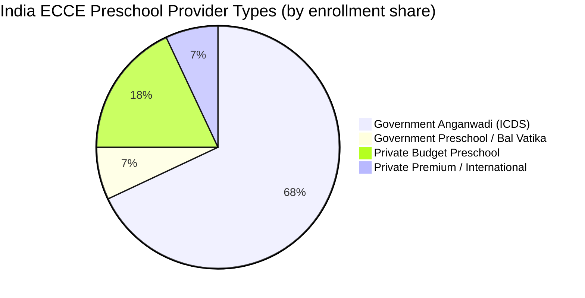
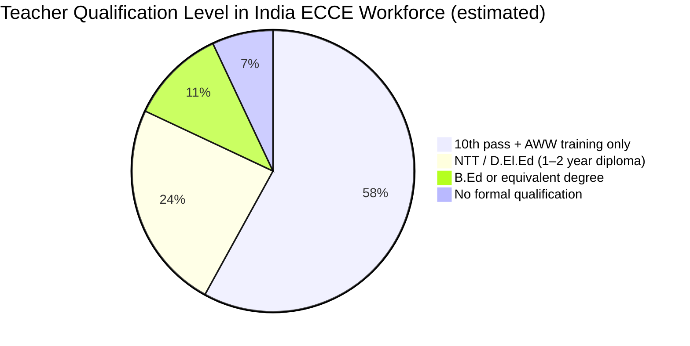

> [!NOTE]
> India's preschool ECCE sector faces a systemic tripartite deficit — undertrained teachers, severely inadequate compensation, and weak policy enforcement — that collectively and measurably impairs inclusive practices for the estimated 3–4 million children with developmental disabilities aged 0–6.

## Key Facts

| Dimension | Current Reality | Policy Target |
|---|---|---|
| AWW Qualification | 10th pass + 6-month training | 2-year ECCE Diploma (NEP 2020, by 2030) |
| AWW Honorarium | Rs 4,500–10,000/month | Parity with primary teachers (NEP 2020) |
| Foundational Stage GER | 41.4% (2024–25) | Universal ECCE access by 2030 |
| Special Educators vs. Need | ~35,000 for 8M children with disabilities (1:229) | Adequate inclusive support for all |
| CWSN Enrollment Trend | Declined 1.1% → 0.9% (2013–2019) | Rising (RPWD 2016 mandate) |
| CwDs under 5 Not in Any Institution | ~75% (3 in 4) | Universal ECCE access |
| Teachers Prepared for Inclusion | ~30% (Das et al. 2013) | 100% (RPWD 2016, DSEL 2023) |
| ECCE Children Receiving Early Intervention | ~10% of those with disabilities | Universal access (RPWD + NEP vision) |

## At a Glance

## Summary

India's Early Childhood Care and Education (ECCE) sector spans 1.35 million Anganwadi Centers (AWCs) serving approximately 80 million children under age 6, making it the largest preschool delivery system in the world by enrollment. Yet the workforce backbone of this system — Anganwadi Workers (AWWs) — are recruited with a minimum 10th-pass qualification, receive 6 months of residential training from NIPCCD, and are compensated with a state-variable honorarium ranging from Rs 4,500 to Rs 10,000 per month. This is not a salary; it carries no statutory benefits (EPF, ESI, gratuity) and signals clearly that the state does not recognize ECCE delivery as skilled professional work.

The consequences for inclusive practice are direct and measurable. Das et al. (2013), in a landmark study of 800 teachers across India, found that 78% felt unprepared to include children with disabilities in their classrooms — a statistic that is particularly damning given that India's RPWD Act 2016 legally mandates inclusive education at all stages, including preschool. The Ability Foundation's 2024 pilot in Tamil Nadu demonstrated that targeted training (5-day intensive disability detection protocol) increased AWW-led early identification rates by 40% — evidence that the deficit is not in AWW capacity to learn but in the system's failure to train, support, and reward inclusive practice.

NEP 2020 and the NCF Foundational Stage 2022 represent genuine policy ambition: universal ECCE, a dedicated ECCE cadre with primary-parity compensation, UDL-informed curricula, and mandatory inclusion training. But as Tanushree Sarkar (UKFIET 2020) incisively documents, NEP 2020 fails to specify budget allocations for disability-specific teacher training, does not mandate minimum training hours for inclusion content, and does not address the transition from segregated special schools to inclusive ECCE settings. The Vidhi Centre for Legal Policy adds a structural critique: the jurisdictional gap between RTE 2009 (covering age 6+) and RPWD 2016 (covering all ages) means that children with disabilities aged 3–6 have a legal right to inclusive education that has no corresponding enforcement mechanism in the school system.

For researchers and curriculum designers with a B.Ed background, the architecture here is familiar: a curriculum framework (NCF-FS) exists, but the implementation layer — qualified, compensated, inclusion-trained facilitators — is absent. Just as a user experience design is only as good as its implementation fidelity, an inclusive ECCE curriculum is only as effective as the teacher who delivers it. The evidence consistently points to teacher beliefs, sustained professional development, and adequate compensation as the three levers that most powerfully predict whether inclusive practice actually reaches children in Indian preschools.
