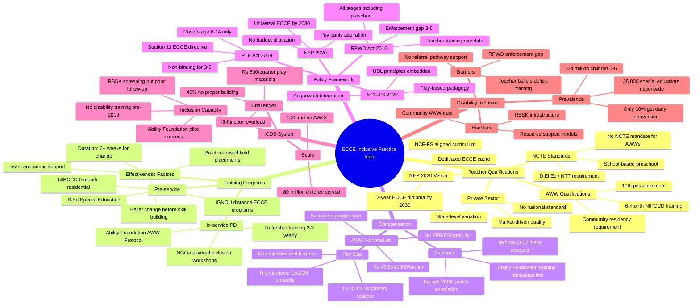
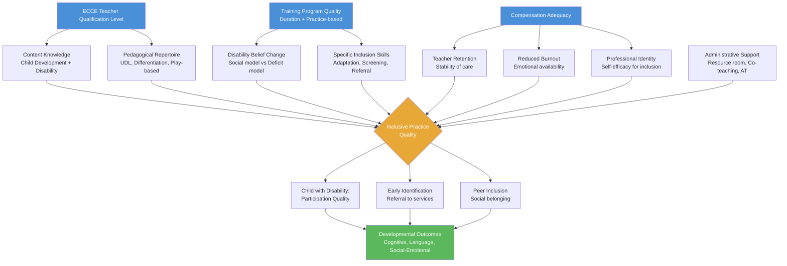

This document maps the structural relationships between teacher inputs (qualifications, training, compensation) and inclusive practice outcomes in India's preschool/ECCE sector, across policy, workforce, and institutional dimensions.

## Topic Structure Mind Map

## Cause-Effect Flowchart: From Inputs to Inclusive Outcomes

## Key Branch Explanations

### Branch 1: Qualifications
India has a **dual-track qualification system**: formal NCTE-governed credentials for school-based preschool teachers, and a minimal 10th-pass + 6-month honorarium-based system for AWWs who serve the majority of ECCE enrollment. This bifurcation is the root structural inequity. NCF-FS 2022 attempts to bridge this by defining a single Foundational Stage, but without a unified qualification standard, the gap persists.

### Branch 2: Training Programs
The critical insight is that **training design matters as much as training duration**. India's NIPCCD 6-month training is substantial in time but weak on disability inclusion content (2 days) and practice-based learning. Effective inclusion training requires attitude change through experiential engagement with children with disabilities — something distance mode and lecture-based programs cannot deliver.

### Branch 3: Compensation
The **honorarium-not-salary** classification of AWWs is not merely a financial issue; it is a statement of institutional value. Research confirms that compensation predicts retention (stability) which predicts child outcomes. The functional overload of 8 ICDS roles further dilutes whatever ECCE quality an AWW might otherwise provide. Pay parity with primary teachers is the single most impactful policy lever for systemic change.

### Branch 4: Policy
Three laws intersect at ages 3–6 with a **jurisdictional vacuum**: RTE stops at age 6, RPWD covers all ages but lacks preschool-specific enforcement, and NEP 2020 aspires to reform both but lacks funded implementation plans. The Vidhi Legal recommendation to extend RTE to age 3 is the legally cleanest intervention.

### Branch 5: ICDS System
The Anganwadi system's greatest asset — **community embeddedness and family trust** — is also its greatest underutilized resource for inclusive practice. AWWs who are trained, supported, and adequately compensated become natural early-identification and family-engagement agents. The Ability Foundation pilot proves this model works at small scale.

### Branch 6: Disability Inclusion
The evidence establishes that **teacher beliefs are the primary lever** for inclusive practice — more than qualifications or training hours. Policy that mandates credentials without addressing the underlying deficit framing of disability will produce compliance without quality. The social model of disability, translated into practical classroom strategies, must anchor all ECCE inclusion teacher education reform.
