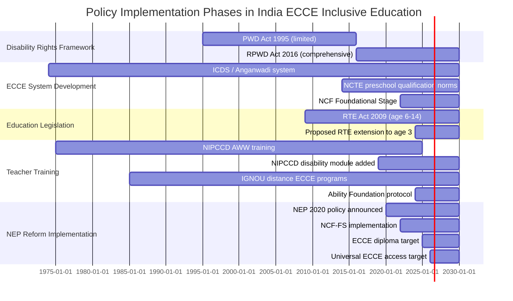

## Chronological Development

```mermaid
timeline
  title Policy and Research Evolution: ECCE Inclusive Education in India
  section Foundation Era
    1974 : ICDS Launched
         : Anganwadi system established nationally
         : AWW role defined with minimal qualification requirements
    1986 : NPE 1986
         : First National Education Policy to mention ECCE
         : Called for universalisation of early childhood education
  section Rights Framework
    1995 : PWD Act 1995
         : Persons with Disabilities Act
         : First disability rights legislation; limited ECCE provisions
    2000 : ICDS Restructuring
         : Expansion of AWC network
         : AWW training under NIPCCD formalized nationally
    2005 : NCF 2005
         : National Curriculum Framework 2005
         : Mentioned ECCE within school readiness frame; no standalone framework
  section Education Reform Decade
    2009 : RTE Act 2009
         : Right to Education for ages 6-14
         : Section 11 directs states on pre-school ECCE
         : No enforcement mechanism for 3-6 age group
    2010 : NCTE B.Ed Special Ed Norms
         : Revised B.Ed Special Education regulations
         : Post-primary focus; limited ECCE inclusion content
    2013 : Das et al. Published
         : Are India teachers prepared for inclusion study
         : 78% of 800 teachers felt unprepared for disability inclusion
    2013 : RBSK Launched
         : Rashtriya Bal Swasthya Karyakram
         : 0-18 screening extending to Anganwadis
  section Standards and Scale
    2014 : NCTE Minimum Qualifications
         : Pre-primary teacher qualification notification
         : D.El.Ed or NTT mandated for school-based preschools
         : AWWs remain outside NCTE scope
    2016 : RPWD Act 2016
         : Rights of Persons with Disabilities Act replaces PWD 1995
         : CRPD-aligned; mandates inclusive education all stages
         : Section 31 requires teacher training in disability
    2017 : NITI Aayog ECCE Report
         : AWW turnover 15-20% documented nationally
         : Pay disparity and multi-function overload highlighted
  section NEP Reform Era
    2019 : NIPCCD Curriculum Revision
         : First disability module added to AWW training
         : 2 days of special needs content in 6-month program
    2020 : NEP 2020
         : National Education Policy 2020 released
         : Universal ECCE by 2030; 2-year ECCE diploma target
         : ECCE-primary pay parity aspiration; no budget
    2022 : NCF Foundational Stage
         : NCF-FS released October 2022
         : Integrates Anganwadi, preschool, Grades 1-2
         : UDL principles; play-based pedagogy mandated
    2023 : DSEL Inclusive Guidelines
         : Department of School Ed and Literacy guidelines
         : Inclusive education framework for government schools
    2024 : Ability Foundation AWW Protocol
         : Disability Detection Protocol piloted Tamil Nadu
         : 40% increase in early identification post-training
  section Pending Reforms
    2026 : NCTE B.Ed Revision
         : Draft revised B.Ed norms under consultation
         : Proposed mandatory inclusive education semester
    2030 : NEP 2020 Targets Due
         : Universal ECCE access deadline
         : All ECCE workers to have 2-year diploma
         : Pay parity implementation expected
```

## Overlapping Policy Phases (Gantt View)

## Narrative: Five Decades of ECCE Policy in India

### 1974–1995: Establishment and Neglect

The launch of ICDS in 1974 was a landmark achievement — it created the world's largest integrated child development program and positioned AWWs as community-level development workers. However, the ECCE component of ICDS was always secondary to nutrition and health functions, and teacher qualification standards were minimal by design: the AWW was envisioned as a community resource person, not a professional educator.

For children with disabilities, this era offered nothing specific. The disability rights movement had not yet produced the legislative framework that would eventually mandate inclusive education. Families with children with developmental disabilities had few options beyond home care or segregated institutions (primarily run by NGOs like ADAPT, Cerebral Palsy of India, NIMH).

### 1995–2009: Rights Framework Begins

The PWD Act 1995 established the first legal mandate for disability-inclusive education, including a requirement for free education in appropriate settings. However, preschool was not explicitly addressed, and enforcement was weak. The period saw growth of NGO-run early intervention centers (primarily in metros), but no systemic integration with the ICDS/AWC network.

RTE 2009 brought enormous momentum to education reform but excluded the 3–6 age group from its binding provisions. Section 11's directive to states on ECCE was advisory, not enforceable.

### 2010–2019: Standards Without Teeth

The NCTE 2014 qualification notification represented genuine progress for school-based preschools — but its exclusion of AWWs meant 68% of ECCE enrollment remained in an unregulated qualification zone. Das et al.'s 2013 study provided the first rigorous national evidence of the inclusion unpreparedness crisis, generating academic attention but limited immediate policy action.

RPWD 2016 was transformative in intent: it aligned India's disability law with CRPD principles, created a stronger right to inclusive education, and explicitly mandated teacher training. But its application to the 3–6 gap remained legally ambiguous and practically unenforced.

### 2020–Present: The NEP 2020 Promise and Its Limits

NEP 2020 and NCF-FS 2022 represent the most comprehensive ECCE reform vision India has articulated. The integration of Anganwadi into the Foundational Stage framework, the 2-year diploma target, the UDL mandate, and the pay parity aspiration are all sound policy directions.

The critical challenge ahead is implementation fidelity. State governments vary enormously in capacity and political will. The ECCE diploma infrastructure does not yet exist at the scale required — there are insufficient ECCE teacher education institutions to train a workforce of 1.35 million AWWs + additional school-based ECCE teachers by 2030. Budget allocations have not been announced at the scale the transformation requires.

The Ability Foundation AWW protocol (2024) offers a glimpse of what targeted, competency-based, practice-focused training can achieve within the existing system. Scaling this approach — with adequate compensation as the enabling condition for retention and motivation — is the most realistic near-term pathway to improving inclusive practices in India's preschools.
