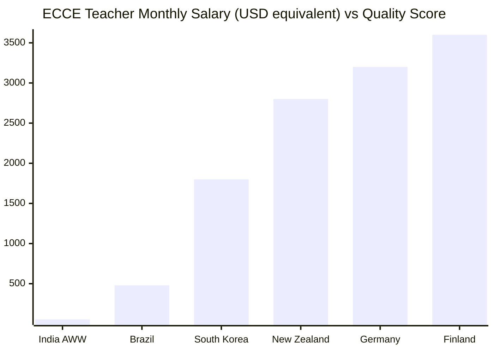
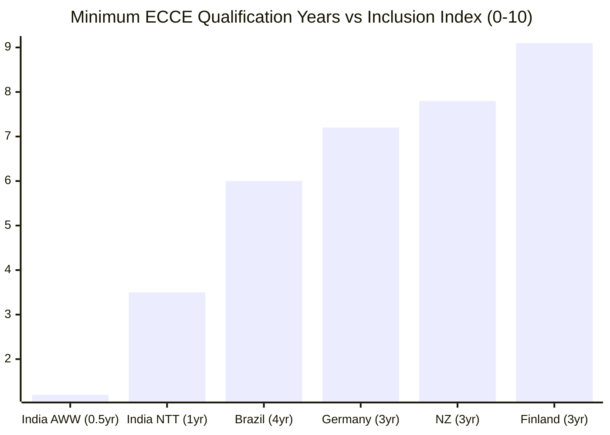
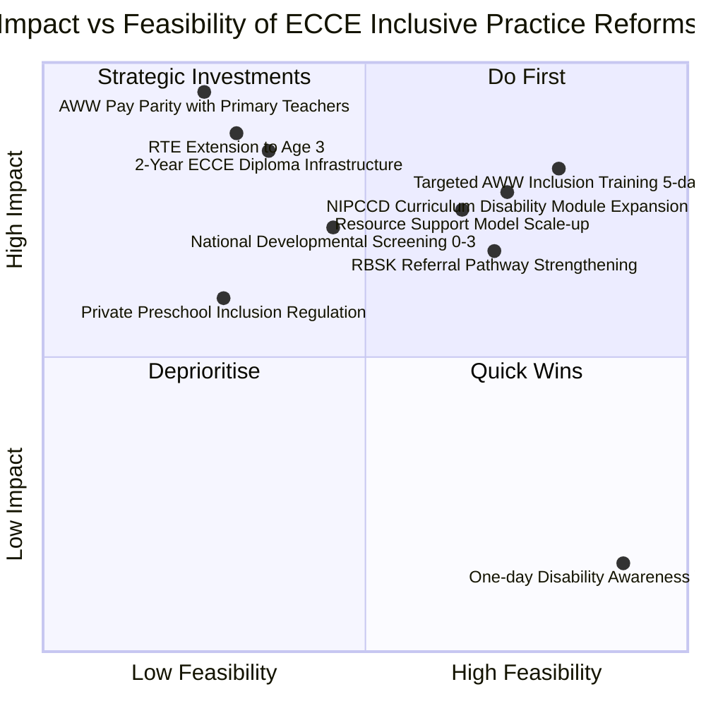

## Comparison: ECCE Provider Types in India

| Dimension | Govt Anganwadi (ICDS) | Govt School Preschool / Bal Vatika | Private Budget Preschool | Private Premium Preschool |
|---|---|---|---|---|
| **Regulatory Body** | MWCD / NIPCCD | NCTE + State Dept of Education | None / State Board | CBSE / IB / ICSE (if affiliated) |
| **Teacher Qualification** | 10th pass + 6-month AWW training | D.El.Ed or NTT (1–2 year) | NTT / Montessori cert (variable) | NTT + B.Ed or foreign cert |
| **Monthly Compensation** | Rs 4,500–10,000 (honorarium) | Rs 15,000–25,000 | Rs 8,000–15,000 | Rs 20,000–50,000 |
| **Employment Status** | Honorarium (scheme worker) | Contractual / Regular | Contractual | Contractual / Regular |
| **Child:Teacher Ratio** | 1:30–40 (target 1:25) | 1:20–25 | 1:25–30 | 1:12–20 |
| **Disability Training** | 2 days in 6-month AWW training | Minimal (not mandated) | None typically | Variable (some have SEN coordinator) |
| **Inclusion Support** | Minimal (RBSK referral only) | Some (depends on school) | Minimal | Better (SEN dept in premium schools) |
| **Infrastructure** | 40% lack dedicated building | Moderate | Basic | Good |
| **Play Materials Budget** | Rs 500/quarter per center | State-dependent | Owner-funded | Well-resourced |
| **Annual Turnover** | 15–20% | 8–12% | 20–35% | 10–15% |
| **Family Engagement** | Strong (community AWW model) | Moderate | Moderate | Structured (parent-teacher meets) |
| **Access to Children with Disabilities** | Highest (universal reach, community trust) | Moderate | Low | Very low (selective admission) |

## Comparison: India vs. International ECCE Systems

## Strategic Positioning: ECCE Reform Levers

## Comparison: Training Models for Inclusive ECCE Practice

| Training Model | Duration | Mode | Inclusion Content | Attitude Change? | Skill Transfer? | Cost | Scalability |
|---|---|---|---|---|---|---|---|
| NIPCCD AWW Induction (current) | 6 months | Residential | 2 days (3%) | Low | Low | Moderate | High |
| IGNOU DPSE Distance | 12 months | Distance/Online | Variable, minimal | Low | Low | Low | Very High |
| Ability Foundation AWW Protocol | 5 days + follow-up | Intensive + phone mentoring | 100% | Moderate-High | High | Low-Moderate | Medium |
| NGO one-day workshops | 1 day | Face-to-face | 100% | Negligible | Negligible | Very Low | Very High |
| Sustained PD (6+ weeks, practice-based) | 6–12 weeks | Blended (classroom + field) | 100% | High | High | High | Low-Medium |
| B.Ed Special Education | 2 years | Full-time | 60–70% | High | High | High | Low |
| Co-teaching with Special Educator | Ongoing | In-classroom | Embedded | High | Very High | High | Low |

## Prose Analysis

### The Qualification-Compensation-Inclusion Triangle

The comparison data reveals a consistent triangular relationship across all preschool types: **qualification level**, **compensation adequacy**, and **inclusion support** move together. Government Anganwadis — the lowest on all three dimensions — also show the greatest gap between policy mandate (RPWD 2016, NEP 2020) and practice reality. Premium private preschools — highest on all three — still lag on disability inclusion relative to international benchmarks, but they are at least a functional starting point.

The critical implication: **you cannot improve inclusion without addressing compensation, and you cannot improve either without addressing qualification pathways.** Policy interventions that address only one leg of the triangle (e.g., mandating inclusion training without improving pay) will have limited and short-lived impact.

### Why One-Day Workshops Are Counterproductive

The quadrant chart reveals a striking paradox: one-day disability awareness workshops score highest on feasibility (cheap, easy to organize, politically visible) but lowest on impact. The evidence from PMC 8988775 and JKPI studies shows effect sizes approaching zero for attitude change and near-zero for practice transfer. Yet these workshops constitute the majority of "inclusion training" delivered in India's ECCE sector. Resources spent on multiple one-day workshops would achieve dramatically more impact if consolidated into a single 5-day intensive competency-based program like the Ability Foundation model.

### The South India Advantage

Karnataka, Kerala, Tamil Nadu, and Andhra Pradesh consistently outperform national ECCE averages. Likely drivers:
- Higher baseline AWW literacy and education
- Better state-level honoraria (particularly Kerala and Karnataka)
- Stronger NGO infrastructure (Ability Foundation in TN, various organizations in Karnataka)
- Political culture of education investment

This creates a natural experiment: if these states implement NEP 2020 ECCE reforms more rapidly, their outcomes relative to BIMARU states will widen further, providing evidence for the reform's efficacy that can drive national adoption.

### The Private Budget Paradox

Perhaps the most concerning finding in the comparisons is the **private budget preschool paradox**: these schools serve lower-middle-income families (above AWC-using families but unable to afford premium schools), have *worse* teacher qualifications and inclusion support than government preschools, yet escape all quality regulation. They employ 18% of India's ECCE enrollment in a complete regulatory vacuum. Any genuine ECCE quality reform must include a minimum quality framework for private budget preschools — currently the sector worst-served by existing policy architecture.
