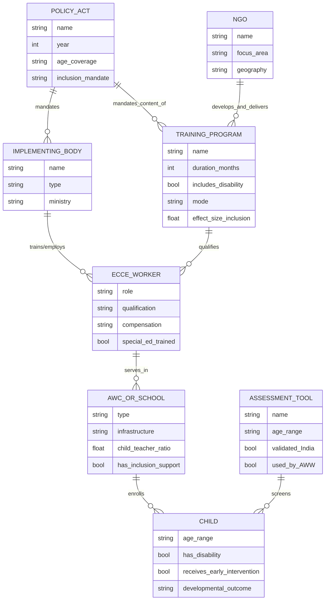
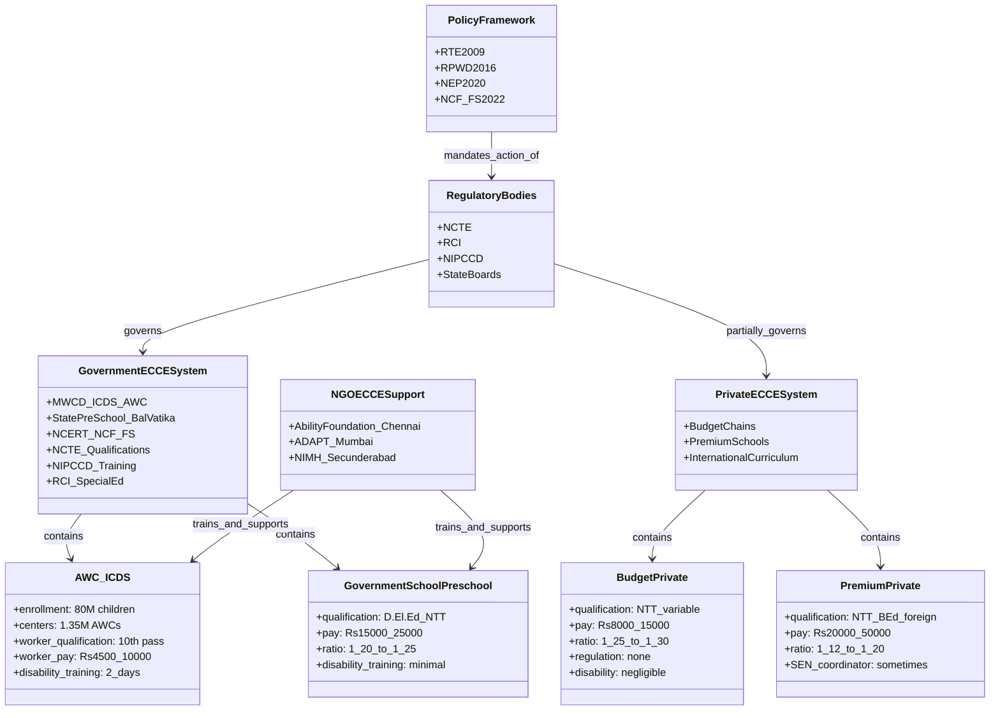

## Entity-Relationship Diagram: ECCE Policy and Workforce System

## Hierarchical Classification: ECCE Institutional Ecosystem

## Prose: Key Relationships Explained

### 1. The Policy → Workforce → Practice Chain

The most important structural relationship in this domain is the **policy-to-practice chain**:

> **Policy mandate → Implementing body → Teacher education program → Teacher qualification/beliefs → Classroom inclusive practice → Child outcomes**

Each link in this chain can break the transmission. India's challenge is that multiple links are simultaneously weak:
- RPWD 2016 mandates teacher training (policy link) → but NIPCCD/NCTE have not mandated sufficient disability content (implementing body link) → so teachers emerge with minimal inclusion competency (teacher education link) → and deliver poor inclusive practice (classroom link) → resulting in poor outcomes for children with disabilities (child link).

### 2. The Compensation → Retention → Stability → Child Outcomes Chain

A second critical chain:

> **Compensation inadequacy → High turnover → Unstable teacher-child relationships → Disrupted attachment and learning for children with disabilities**

Children with developmental disabilities are disproportionately vulnerable to teacher instability: they require consistent, predictable relationships to develop trust, communication, and learning routines. The AWW honorarium system produces precisely the opposite — financially stressed workers who leave at 15–20% annual rates, disrupting the relational continuity that vulnerable children most need.

### 3. NCTE–RCI–NIPCCD: Fragmented Governance

The **regulatory fragmentation** is the structural cause of the qualification gap:
- **NCTE** governs teacher education for school-based preschools (Ministry of Education)
- **RCI** governs special education teacher training (Ministry of Social Justice & Empowerment)
- **NIPCCD** governs AWW training (Ministry of Women and Child Development)

These three bodies operate under different ministries with no coordination mandate. An ECCE child with a disability thus falls under: NCTE (if in school preschool), plus RCI (if a special educator is involved), plus NIPCCD (if in Anganwadi) — with no single body responsible for ensuring that any of these teachers has received disability-inclusive ECCE training.

### 4. AWW–Community–Family: The Underutilized Asset

The **AWW-community relationship** is the system's most underutilized asset for inclusive practice:
- AWWs are recruited from the local community and know families personally
- They speak the local language (including tribal languages)
- Parents trust them in ways they may not trust formal teachers
- This positions AWWs as ideal **first-line identifiers** of developmental concerns

The Ability Foundation pilot demonstrates that this relationship, combined with targeted training and a structured protocol, produces measurable improvements in early disability identification. The relationship is the asset; training is the activation mechanism; compensation is the sustainability condition.

### 5. NGO → Government Pathway

A critical relationship that is often overlooked: **NGOs as innovation incubators for government adoption**. Organizations like Ability Foundation (Chennai), ADAPT (Mumbai), and NIMH (Secunderabad, Hyderabad) develop, pilot, and refine inclusive ECCE models that are then (sometimes) adopted by government programs. The AWW Disability Detection Protocol is a current example. This NGO-government pathway is India's primary mechanism for evidence-based ECCE policy innovation — formal research-to-policy pipelines being underdeveloped.
